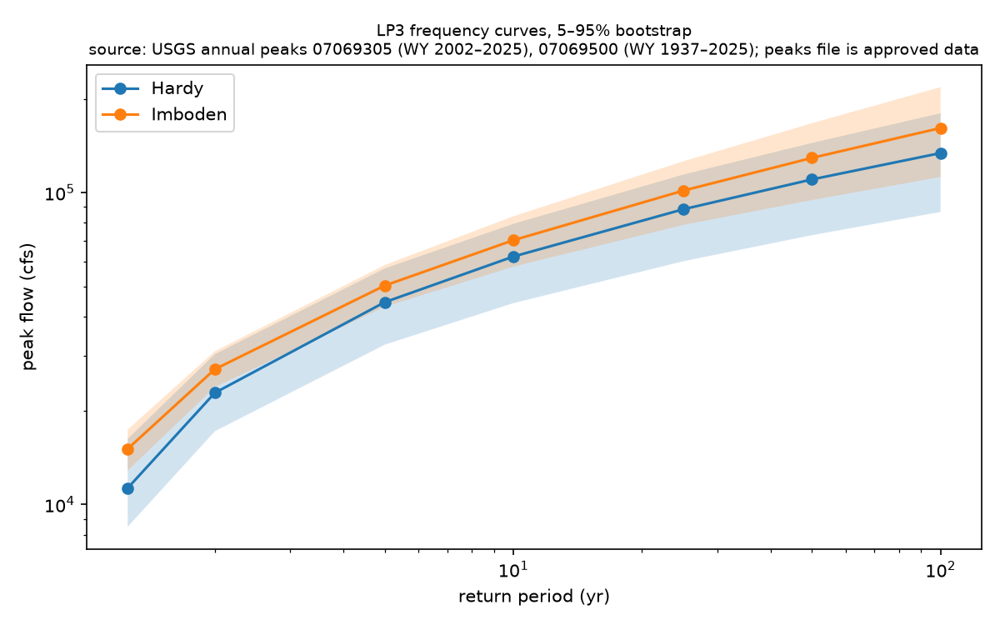
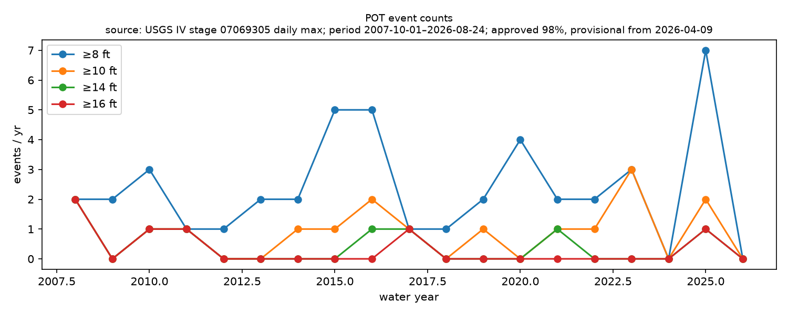

# Phase 5 — floods (Q2, Q6, Q7, Q8) — generated 2026-08-25

## Q8 LP3 flood frequency (5–95% bootstrap CI)

Regional skew -0.2 (approximate, see config); the 'station skew only' block is the sensitivity case. LP3 by method of moments with B17-weighted skew and a Grubbs-Beck low-outlier screen; parametric-bootstrap CIs (2000 resamples). Not EMA.

### Hardy (n=24, WY 2002–2025, station skew -0.16, weighted skew -0.18, low outliers dropped 0 below 2969 cfs)

|   return_period |   q_cfs |   q_lo |   q_hi |
|----------------:|--------:|-------:|-------:|
|            1.25 |   11288 |   8480 |  16234 |
|            2    |   22807 |  17174 |  30339 |
|            5    |   44552 |  32553 |  57162 |
|           10    |   62391 |  44231 |  79436 |
|           25    |   88469 |  60276 | 114284 |
|           50    |  110266 |  73057 | 144373 |
|          100    |  133946 |  86732 | 179736 |

### Hardy — station skew only (n=24, WY 2002–2025, station skew -0.16, weighted skew -0.16, low outliers dropped 0 below 2969 cfs)

|   return_period |   q_cfs |   q_lo |   q_hi |
|----------------:|--------:|-------:|-------:|
|            1.25 |   11278 |   8442 |  16261 |
|            2    |   22752 |  16878 |  30843 |
|            5    |   44528 |  32251 |  57153 |
|           10    |   62503 |  44495 |  78684 |
|           25    |   88936 |  61141 | 113279 |
|           50    |  111155 |  74639 | 145558 |
|          100    |  135408 |  88441 | 184185 |

### Imboden (n=88, WY 1937–2025, station skew 0.27, weighted skew 0.17, low outliers dropped 1 below 2724 cfs)

|   return_period |   q_cfs |   q_lo |   q_hi |
|----------------:|--------:|-------:|-------:|
|            1.25 |   15080 |  12849 |  17378 |
|            2    |   27157 |  23799 |  30994 |
|            5    |   50366 |  43066 |  58596 |
|           10    |   70393 |  57912 |  84017 |
|           25    |  101514 |  78790 | 126089 |
|           50    |  129248 |  94700 | 166984 |
|          100    |  161159 | 112250 | 217984 |

### Stage thresholds at Hardy

Stage→flow from the 24 annual-peak (stage, flow) pairs: log10 Q = 1.954 + 2.215·log10 H (R²=0.991). NWS categories: action 8, minor 10, moderate 14, major 16 ft.

|   stage_ft |   flow_cfs |   lp3_return_period_yr |   empirical_exceedances_2002_2025 | empirical_return_period_yr   |   nws_crests_ge_stage_1982_2025 |
|-----------:|-----------:|-----------------------:|----------------------------------:|:-----------------------------|--------------------------------:|
|          8 |       9001 |                    1.2 |                                22 | 1.1                          |                              21 |
|         10 |      14756 |                    1.4 |                                16 | 1.5                          |                              20 |
|         14 |      31093 |                    2.9 |                                 9 | 2.7                          |                              11 |
|         16 |      41795 |                    4.5 |                                 6 | 4.0                          |                               8 |
|         20 |      68516 |                   12.5 |                                 3 | 8.0                          |                               5 |
|         23 |      93380 |                   29.4 |                                 0 | >1000                        |                               1 |

NWS crest count includes the 1982-12-03 29.0 ft record; the Hardy systematic record is WY 2002+. Empirical return period = n_years / exceedances of the annual-peak stage.

## Q2 stationarity

- Hardy annual peaks (log10 cfs): Sen slope 0.00125 log10-cfs/yr (95% CI -0.0231 to 0.03); MK z=0.17, p=0.862; n=24; Pettitt change after WY 2011 (p=1.000)
- Imboden annual peaks (log10 cfs): Sen slope 0.00112 log10-cfs/yr (95% CI -0.00122 to 0.00406); MK z=0.94, p=0.346; n=89; Pettitt change after WY 2005 (p=0.350)

Imboden LP3 split at WY 2008:

### Imboden WY <2008 (n=70, WY 1937–2007, station skew 0.27, weighted skew 0.16, low outliers dropped 1 below 2704 cfs)

|   return_period |   q_cfs |   q_lo |   q_hi |
|----------------:|--------:|-------:|-------:|
|            1.25 |   14092 |  11104 |  16561 |
|            2    |   25041 |  21736 |  29003 |
|            5    |   45725 |  38778 |  54102 |
|           10    |   63330 |  51325 |  78226 |
|           25    |   90386 |  67611 | 119009 |
|           50    |  114267 |  80629 | 158348 |
|          100    |  141536 |  93416 | 208511 |

### Imboden WY ≥2008 (n=18, WY 2008–2025, station skew 0.28, weighted skew 0.04, low outliers dropped 0 below 7251 cfs)

|   return_period |   q_cfs |   q_lo |   q_hi |
|----------------:|--------:|-------:|-------:|
|            1.25 |   20973 |  16690 |  28393 |
|            2    |   38043 |  28932 |  51329 |
|            5    |   69516 |  49333 |  92808 |
|           10    |   95546 |  64510 | 126275 |
|           25    |  134424 |  85898 | 177533 |
|           50    |  167798 | 103119 | 224480 |
|          100    |  205010 | 120817 | 277209 |

## Partial-duration series (Hardy daily max IV stage, 7-day declustering)

- ≥8 ft: 45 events over WY 2008–2026; mean 2.37/yr; dispersion 1.37 (p=0.269); count trend Sen slope 0 events/yr (95% CI -0.118 to 0.167); MK z=0.00, p=1.000; n=19
- ≥10 ft: 17 events over WY 2008–2026; mean 0.89/yr; dispersion 0.86 (p=0.733); count trend Sen slope 0 events/yr (95% CI 0 to 0.0714); MK z=0.08, p=0.940; n=19
- ≥14 ft: 8 events over WY 2008–2026; mean 0.42/yr; dispersion 0.88 (p=0.780); count trend Sen slope 0 events/yr (95% CI 0 to 0); MK z=-1.12, p=0.261; n=19
- ≥16 ft: 6 events over WY 2008–2026; mean 0.32/yr; dispersion 1.07 (p=0.743); count trend Sen slope 0 events/yr (95% CI 0 to 0); MK z=-1.42, p=0.155; n=19

Dispersion index = variance/mean of annual counts (1 under Poisson; >1 clustered). WY 2026 is partial (stage through 2026-08-24). Sensitivity (approved-only days) totals: ≥8 ft 45, ≥10 ft 17, ≥14 ft 8, ≥16 ft 6

|   wy |   ge_8ft_all |   ge_10ft_all |   ge_14ft_all |   ge_16ft_all |   ge_8ft_approved |   ge_10ft_approved |   ge_14ft_approved |   ge_16ft_approved |
|-----:|-------------:|--------------:|--------------:|--------------:|------------------:|-------------------:|-------------------:|-------------------:|
| 2008 |            2 |             2 |             2 |             2 |                 2 |                  2 |                  2 |                  2 |
| 2009 |            2 |             0 |             0 |             0 |                 2 |                  0 |                  0 |                  0 |
| 2010 |            3 |             1 |             1 |             1 |                 3 |                  1 |                  1 |                  1 |
| 2011 |            1 |             1 |             1 |             1 |                 1 |                  1 |                  1 |                  1 |
| 2012 |            1 |             0 |             0 |             0 |                 1 |                  0 |                  0 |                  0 |
| 2013 |            2 |             0 |             0 |             0 |                 2 |                  0 |                  0 |                  0 |
| 2014 |            2 |             1 |             0 |             0 |                 2 |                  1 |                  0 |                  0 |
| 2015 |            5 |             1 |             0 |             0 |                 5 |                  1 |                  0 |                  0 |
| 2016 |            5 |             2 |             1 |             0 |                 5 |                  2 |                  1 |                  0 |
| 2017 |            1 |             1 |             1 |             1 |                 1 |                  1 |                  1 |                  1 |
| 2018 |            1 |             0 |             0 |             0 |                 1 |                  0 |                  0 |                  0 |
| 2019 |            2 |             1 |             0 |             0 |                 2 |                  1 |                  0 |                  0 |
| 2020 |            4 |             0 |             0 |             0 |                 4 |                  0 |                  0 |                  0 |
| 2021 |            2 |             1 |             1 |             0 |                 2 |                  1 |                  1 |                  0 |
| 2022 |            2 |             1 |             0 |             0 |                 2 |                  1 |                  0 |                  0 |
| 2023 |            3 |             3 |             0 |             0 |                 3 |                  3 |                  0 |                  0 |
| 2024 |            0 |             0 |             0 |             0 |                 0 |                  0 |                  0 |                  0 |
| 2025 |            7 |             2 |             1 |             1 |                 7 |                  2 |                  1 |                  1 |
| 2026 |            0 |             0 |             0 |             0 |                 0 |                  0 |                  0 |                  0 |

## Q6 inter-arrival of ≥16 ft events

Events (annual-peak file for WY <2008, 7-day-declustered daily-max IV stage for WY ≥2008): 2006-09-23, 2008-03-19, 2008-04-10, 2009-10-30, 2011-04-26, 2017-04-30, 2025-04-05

- 2002–present: n=7, mean gap 3.09 yr, median 1.52, CV 1.01; KS vs exponential 0.27, bootstrap p=0.465
- with 1982 crest: n=8, mean gap 6.05 yr, median 1.56, CV 1.38; KS vs exponential 0.34, bootstrap p=0.108

A bootstrap p well above 0.05 means the gaps are consistent with a memoryless (Poisson) process — no evidence of a regular cadence; CV near 1 is the exponential signature, CV well below 1 would indicate regularity.

## Q7 quiet year (<8 ft peak) after a ≥16 ft year

- P(quiet | prior major) = 0.00 vs base rate 0.08; difference -0.08 (bootstrap 95% CI -0.21 to +0.00); permutation p=1.000; n_major=5, n_years=24

Water years with a missing annual peak count as neither major nor quiet. With n_major=5 the test has little power; the CI is the honest statement.

## Antecedent conditions before ≥14 ft annual peaks (60-day BFI, 30-day basin precip)

| event_date          |   bfi_prior |   precip_prior_in |   baseflow_prior_cfs |
|:--------------------|------------:|------------------:|---------------------:|
| 2003-11-18 00:00:00 |        0.81 |              1.98 |               383.07 |
| 2006-09-23 00:00:00 |        0.8  |              3.39 |               242.65 |
| 2008-03-19 00:00:00 |        0.51 |              6.52 |               798.16 |
| 2009-10-30 00:00:00 |        0.55 |              9.96 |              1191.44 |
| 2011-04-26 00:00:00 |        0.43 |             12.49 |               805.81 |
| 2015-12-28 00:00:00 |        0.54 |              7.58 |               927.3  |
| 2017-04-30 00:00:00 |        0.64 |              9.38 |              1086.58 |
| 2021-04-29 00:00:00 |        0.7  |              3.18 |              1329.99 |
| 2025-04-05 00:00:00 |        0.8  |              3.43 |              1277.95 |

BFI from segmented Eckhardt on Hardy DV discharge; precip is the PRISM 30 km-buffer basin mean. Windows exclude the event day.

## Stationarity verdict

**Verdict: no detectable change in flood frequency.**

- Imboden peak trend CI excludes zero: no (Sen slope +0.0011 log10-cfs/yr, 95% CI -0.0012 to +0.0041).
- Imboden 10-yr quantile, WY <2008: 63,330 cfs (5–95% 51,325–78,226); WY ≥2008: 95,546 cfs (64,510–126,275); CIs overlap: yes.
- Rule: 'non-stationary' requires both a trend CI excluding zero and non-overlapping split-period 10-yr CIs. Magnitude-tier comparison at Hardy rests on n=24.

## Limitations

- LP3/MOM with weighted skew, not EMA; 1982 historical crest not in the fit. Regional skew approximate.
- Hardy n=24; return periods beyond ~50 yr are extrapolation — the CIs say so.
- Stage↔flow mapping is a log-log fit to annual-peak pairs, not the USGS rating; rating shifts (Q5) propagate here.
- POT and Q6 post-2008 events use daily MAX IV stage (upper bound vs a daily-mean product).
- Imboden peaks file in NWIS begins WY 1937; the split at WY 2008 leaves n=18 in the post period.
