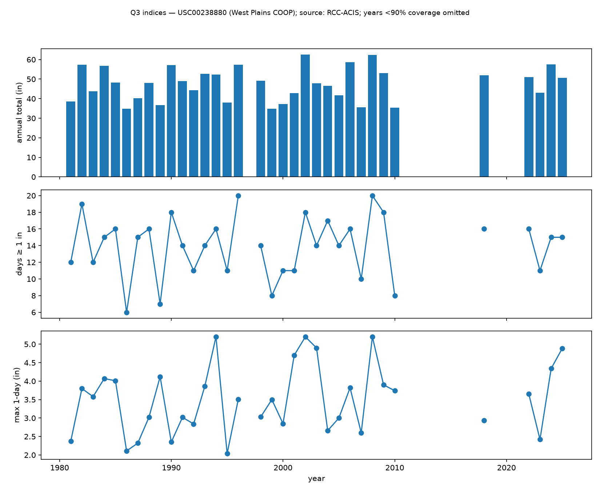
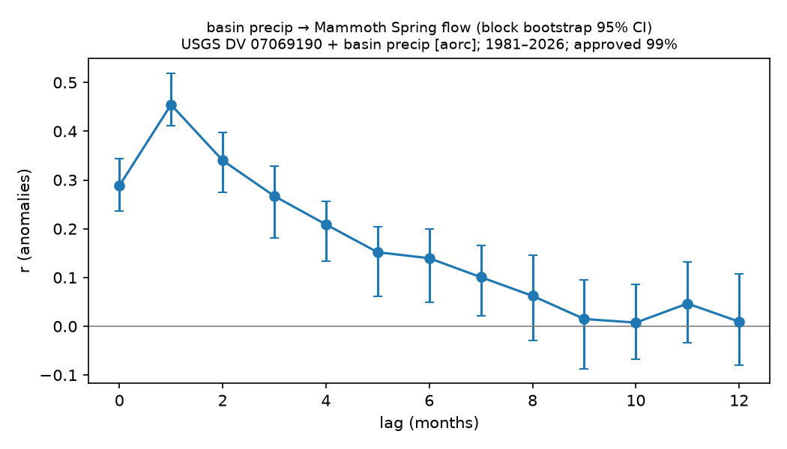

# Phase 6 — precipitation regime (Q3) — generated 2026-08-25

Series: USC00238880 West Plains COOP (1981-01-01–2026-08-24; COOP series 1981+ in this build — the ACIS cache is keyed on station id, so the 1948 request returned the cached 1981+ pull; a 1948 backfill needs a `refresh=True` pull), KUNO ASOS (1998-04-01–2026-08-23), USC00230127 Alton COOP (1981-01-01–2026-08-03), basin = NOAA AORC v1.1 1 km hourly basin mean over the MoDNR Mammoth Spring recharge polygon (~349 mi²), daily totals 24 h ending 12 UTC (1981-01-02–2025-12-31).

## Station agreement on monthly totals (qa_report follow-up)

- KUNO vs USC00238880 monthly totals (months with ≥25 days at both stations): r=0.86, ratio COOP/KUNO=1.07, n=282 months (1998-04 to 2026-06). Daily r was 0.42 in qa_report; monthly aggregation removes the ~7 AM observation-day offset.

## USC00238880: index trends (Sen slope per decade, 95% CI; BH-adjusted p across 10 indices)

- series span (non-missing days): 1981-01-01–2026-08-24
- index years 1981–2025; years passing 90% coverage: 34
- no index passes BH at q=0.05

| index       |   n |   slope_per_decade |     lo |    hi |     z |     p |   p_bh | significant_bh   |
|:------------|----:|-------------------:|-------:|------:|------:|------:|-------:|:-----------------|
| total_in    |  34 |              0.758 | -1.667 | 3.5   | 0.741 | 0.459 |  0.801 | False            |
| recharge_in |  30 |              0.233 | -1.58  | 1.869 | 0.357 | 0.721 |  0.801 | False            |
| growing_in  |  34 |              0.9   | -0.767 | 2.683 | 1.097 | 0.273 |  0.801 | False            |
| days_ge_0p5 |  34 |              0.75  | -0.789 | 2.083 | 0.954 | 0.34  |  0.801 | False            |
| days_ge_1   |  34 |             -0     | -0.769 | 1.212 | 0.374 | 0.709 |  0.801 | False            |
| days_ge_2   |  34 |             -0     | -0.476 | 0.455 | 0     | 1     |  1     | False            |
| max1_in     |  34 |              0.2   | -0.1   | 0.494 | 1.187 | 0.235 |  0.801 | False            |
| max3_in     |  34 |              0.508 |  0.072 | 0.91  | 2.491 | 0.013 |  0.127 | False            |
| top5_frac   |  34 |              0.002 | -0.006 | 0.011 | 0.563 | 0.573 |  0.801 | False            |
| sdii_in     |  34 |              0.004 | -0.013 | 0.019 | 0.534 | 0.594 |  0.801 | False            |

## KUNO: index trends (Sen slope per decade, 95% CI; BH-adjusted p across 10 indices)

- series span (non-missing days): 1998-04-01–2026-08-23
- index years 1999–2025; years passing 90% coverage: 27
- BH-significant: sdii_in (+0.0634/decade, 95% CI 0.033 to 0.09, n=27 years)

| index       |   n |   slope_per_decade |     lo |     hi |      z |     p |   p_bh | significant_bh   |
|:------------|----:|-------------------:|-------:|-------:|-------:|------:|-------:|:-----------------|
| total_in    |  27 |              4.279 | -0.557 | 10.261 |  1.709 | 0.087 |  0.226 | False            |
| recharge_in |  27 |              1.518 | -0.596 |  3.347 |  1.626 | 0.104 |  0.226 | False            |
| growing_in  |  27 |              3.4   | -1.075 |  7.131 |  1.584 | 0.113 |  0.226 | False            |
| days_ge_0p5 |  27 |              3.333 | -0     |  7.5   |  1.861 | 0.063 |  0.226 | False            |
| days_ge_1   |  27 |              1.429 | -0.769 |  3.077 |  1.3   | 0.194 |  0.277 | False            |
| days_ge_2   |  27 |              0.455 | -0     |  1.25  |  1.414 | 0.157 |  0.262 | False            |
| max1_in     |  27 |              0.25  | -0.21  |  0.75  |  1.209 | 0.227 |  0.283 | False            |
| max3_in     |  27 |              0.4   | -0.562 |  1.437 |  0.709 | 0.478 |  0.532 | False            |
| top5_frac   |  27 |             -0.003 | -0.024 |  0.019 | -0.208 | 0.835 |  0.835 | False            |
| sdii_in     |  27 |              0.063 |  0.033 |  0.09  |  3.377 | 0.001 |  0.007 | True             |

## USC00230127: index trends (Sen slope per decade, 95% CI; BH-adjusted p across 10 indices)

- series span (non-missing days): 1981-01-01–2026-08-03
- index years 1982–2025; years passing 90% coverage: 24
- no index passes BH at q=0.05

| index       |   n |   slope_per_decade |     lo |    hi |      z |     p |   p_bh | significant_bh   |
|:------------|----:|-------------------:|-------:|------:|-------:|------:|-------:|:-----------------|
| total_in    |  24 |              2.169 | -2.128 | 6.6   |  1.067 | 0.286 |  0.515 | False            |
| recharge_in |  21 |              0.678 | -1.324 | 2.725 |  0.876 | 0.381 |  0.545 | False            |
| growing_in  |  24 |              1.595 | -1.336 | 4.354 |  1.215 | 0.224 |  0.515 | False            |
| days_ge_0p5 |  24 |              0.801 | -1.538 | 3.478 |  0.774 | 0.439 |  0.549 | False            |
| days_ge_1   |  24 |              1.25  | -0.769 | 3.333 |  1.076 | 0.282 |  0.515 | False            |
| days_ge_2   |  24 |             -0     | -0.455 | 0.667 |  0.484 | 0.628 |  0.691 | False            |
| max1_in     |  24 |              0.066 | -0.485 | 0.489 |  0.397 | 0.691 |  0.691 | False            |
| max3_in     |  24 |              0.412 | -0.25  | 1.076 |  1.364 | 0.172 |  0.515 | False            |
| top5_frac   |  24 |             -0.011 | -0.027 | 0.01  | -1.116 | 0.264 |  0.515 | False            |
| sdii_in     |  24 |              0.022 | -0.027 | 0.07  |  1.017 | 0.309 |  0.515 | False            |

## basin: index trends (Sen slope per decade, 95% CI; BH-adjusted p across 10 indices)

- series span (non-missing days): 1981-01-02–2025-12-31
- index years 1981–2025; years passing 90% coverage: 45
- BH-significant: growing_in (+1.46/decade, 95% CI 0.207 to 2.9, n=45 years), days_ge_1 (+1.38/decade, 95% CI 0.488 to 2.22, n=45 years), days_ge_2 (+0.286/decade, 95% CI -0 to 0.625, n=45 years), max1_in (+0.264/decade, 95% CI 0.0517 to 0.495, n=45 years), top5_frac (+0.00988/decade, 95% CI 0.00264 to 0.0177, n=45 years), sdii_in (+0.0324/decade, 95% CI 0.0204 to 0.0461, n=45 years)

| index       |   n |   slope_per_decade |     lo |    hi |      z |     p |   p_bh | significant_bh   |
|:------------|----:|-------------------:|-------:|------:|-------:|------:|-------:|:-----------------|
| total_in    |  45 |              0.96  | -1.25  | 3.124 |  0.851 | 0.395 |  0.395 | False            |
| recharge_in |  44 |             -0.806 | -1.993 | 0.602 | -1.163 | 0.245 |  0.306 | False            |
| growing_in  |  45 |              1.464 |  0.207 | 2.898 |  2.181 | 0.029 |  0.049 | True             |
| days_ge_0p5 |  45 |              1.745 | -0     | 3.333 |  2.049 | 0.04  |  0.058 | False            |
| days_ge_1   |  45 |              1.379 |  0.488 | 2.222 |  2.947 | 0.003 |  0.016 | True             |
| days_ge_2   |  45 |              0.286 | -0     | 0.625 |  2.181 | 0.029 |  0.049 | True             |
| max1_in     |  45 |              0.264 |  0.052 | 0.495 |  2.358 | 0.018 |  0.046 | True             |
| max3_in     |  45 |              0.147 | -0.12  | 0.534 |  1.086 | 0.278 |  0.308 | False            |
| top5_frac   |  45 |              0.01  |  0.003 | 0.018 |  2.514 | 0.012 |  0.04  | True             |
| sdii_in     |  45 |              0.032 |  0.02  | 0.046 |  4.373 | 0     |  0     | True             |

## Station vs basin: reading the divergence

- BH-significant indices per series: USC00238880 0/10, KUNO 1/10, USC00230127 0/10, basin 6/10.
- USC00238880 years failing 90% coverage (excluded from its trend tests): 1997, 2011, 2012, 2013, 2014, 2015, 2016, 2017, 2019, 2020, 2021. The 2011–2021 hole removes most of the recent wet decade from the station test, so its null result is low power, not evidence against the basin trend.
- `recharge_in` uses a stricter gate than the other indices: coverage is judged against the full Sep (year-1)–Feb (year) calendar season, so it is NaN for any year whose season straddles a series start or a gap (e.g. a series beginning 1 Jan has no recharge value for its first year). Its n can therefore be smaller than the other indices' n for the same series, never larger.
- Basin values are NOAA AORC v1.1 1 km hourly basin mean over the MoDNR Mammoth Spring recharge polygon (~349 mi²), daily totals 24 h ending 12 UTC; station gaps enter a gridded product only through its gauge blending. Treat the basin trends as the Q3 headline and the station tests as a consistency check.
- USC00230127 (Alton) has no data 1983–1994 and 2012–2016; its trend test covers ~26 years and is a consistency check only.

## Coupling: monthly basin precip → Mammoth Spring flow (anomaly correlation by lag)

Monthly anomalies (climatology removed; log flow), lags 0–12 months, 1000 12-month block-bootstrap resamples for the CI (both variants, 1 s). Table: all data.

|   lag |     r |   r_lo |   r_hi |   n |
|------:|------:|-------:|-------:|----:|
|     0 | 0.288 |  0.237 |  0.344 | 538 |
|     1 | 0.454 |  0.412 |  0.519 | 539 |
|     2 | 0.34  |  0.274 |  0.397 | 540 |
|     3 | 0.267 |  0.18  |  0.329 | 540 |
|     4 | 0.209 |  0.133 |  0.256 | 540 |
|     5 | 0.152 |  0.061 |  0.203 | 540 |
|     6 | 0.14  |  0.05  |  0.199 | 540 |
|     7 | 0.101 |  0.021 |  0.166 | 540 |
|     8 | 0.062 | -0.029 |  0.145 | 539 |
|     9 | 0.015 | -0.087 |  0.094 | 538 |
|    10 | 0.007 | -0.068 |  0.087 | 537 |
|    11 | 0.047 | -0.033 |  0.132 | 536 |
|    12 | 0.009 | -0.08  |  0.108 | 535 |

- response lag (max r): 1 months, r=0.45 (95% CI 0.41 to 0.52), n=539 months

### Sensitivity: all vs approved-only Mammoth flow

- response lag (all data): 1 months, r=0.45 (95% CI 0.41 to 0.52), n=539 months
- response lag (approved-only flow): 1 months, r=0.45 (95% CI 0.41 to 0.52), n=539 months
- unchanged: same response lag and overlapping r CIs.

Figure: annual total, days ≥ 1 in, and max 1-day precip at USC00238880; source RCC-ACIS StnData; period 1981-01-01–2026-08-24; years with <90% daily coverage omitted; approval N/A — station precip carries no approval flag.

Figure: source: USGS DV 07069190 + NOAA AORC v1.1 1 km hourly basin mean over the MoDNR Mammoth Spring recharge polygon (~349 mi²), daily totals 24 h ending 12 UTC; period 1981-02-25–2026-08-23; approved 99%, provisional from 2026-04-09.

## Limitations

- Station indices are point measurements; basin indices are a gridded areal mean (NOAA AORC v1.1 1 km hourly basin mean over the MoDNR Mammoth Spring recharge polygon (~349 mi²), daily totals 24 h ending 12 UTC) — smoother extremes by construction.
- COOP series 1981+ in this build (cache keyed on station id); the 1948–1980 record is not yet pulled, so the USC00238880 trend window matches KUNO/basin rather than extending it.
- USC00238880 has 32 gaps > 7 days (qa_report); years failing 90% coverage are NaN, not low. KUNO years before 1998 are NaN by coverage.
- Precip series carry no approval flag; the all/approved-only rule does not apply to the index trends. It does apply to the coupling (Mammoth flow carries flags) and is reported above. Mammoth flow used in coupling: source: USGS DV 07069190; period 1981-02-25–2026-08-23; approved 99%, provisional from 2026-04-09.
- Lag-correlation CI is a 12-month block bootstrap of the lagged pairs; it preserves within-year serial correlation but not dependence across block boundaries, so it is mildly optimistic.
