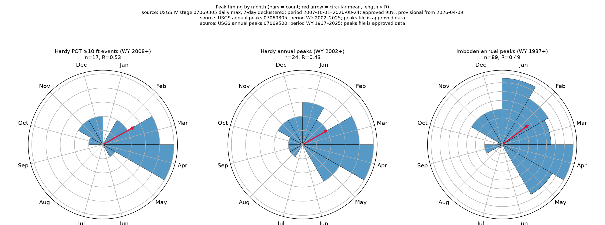
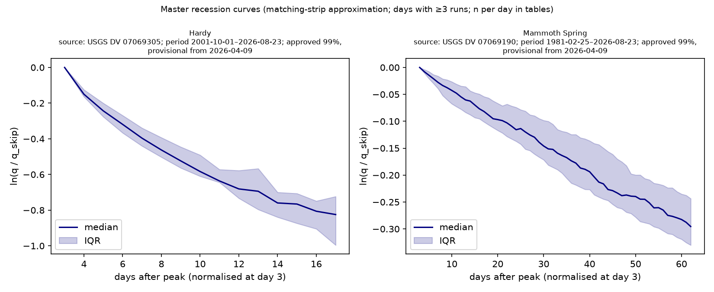

# Phase 7 — seasonality and recession — generated 2026-08-25

## Peak timing (circular statistics by calendar decade)

Mean date is the circular mean of day-of-year; R is the mean resultant length (0 = uniform through the year, 1 = every peak on the same day); Rayleigh p tests uniformity (Zar approximation, adequate for n ≥ 3; blank below that). Decades are calendar decades, so the first row of each series is partial.

### Hardy POT ≥10 ft events (WY 2008+)

source: USGS IV stage 07069305 daily max, 7-day declustered; period 2007-10-01–2026-08-24; approved 98%, provisional from 2026-04-09

| period    |   n |   mean_doy | mean_date_label   |     R |   rayleigh_p |
|:----------|----:|-----------:|:------------------|------:|-------------:|
| 2000–2009 |   3 |       65.2 | 06 Mar            | 0.402 |       0.6514 |
| 2010–2019 |   7 |       41.1 | 10 Feb            | 0.545 |       0.1247 |
| 2020–2029 |   7 |       79.1 | 20 Mar            | 0.643 |       0.0495 |
| all       |  17 |       62.2 | 03 Mar            | 0.534 |       0.0062 |

Whole series: n=17, mean date 03 Mar, R=0.534, Rayleigh p=0.0062.

### Hardy annual peaks (WY 2002+)

source: USGS annual peaks 07069305; period WY 2002–2025; peaks file is approved data

| period    |   n |   mean_doy | mean_date_label   |     R |   rayleigh_p |
|:----------|----:|-----------:|:------------------|------:|-------------:|
| 2000–2009 |   9 |       10.2 | 10 Jan            | 0.433 |       0.1878 |
| 2010–2019 |   9 |       57.2 | 26 Feb            | 0.62  |       0.0268 |
| 2020–2029 |   6 |      120.3 | 30 Apr            | 0.687 |       0.0526 |
| all       |  24 |       61.9 | 03 Mar            | 0.426 |       0.0115 |

Whole series: n=24, mean date 03 Mar, R=0.426, Rayleigh p=0.0115.

### Imboden annual peaks (WY 1937+)

source: USGS annual peaks 07069500; period WY 1937–2025; peaks file is approved data

| period    |   n |   mean_doy | mean_date_label   |     R |   rayleigh_p |
|:----------|----:|-----------:|:------------------|------:|-------------:|
| 1930–1939 |   3 |       42.9 | 12 Feb            | 0.939 |       0.0582 |
| 1940–1949 |  10 |       61.1 | 02 Mar            | 0.679 |       0.0068 |
| 1950–1959 |  10 |       58.3 | 27 Feb            | 0.586 |       0.0281 |
| 1960–1969 |  10 |       99.5 | 09 Apr            | 0.501 |       0.0787 |
| 1970–1979 |  11 |       40.2 | 09 Feb            | 0.389 |       0.1911 |
| 1980–1989 |   9 |       17.9 | 18 Jan            | 0.68  |       0.0115 |
| 1990–1999 |  10 |       87   | 28 Mar            | 0.309 |       0.3945 |
| 2000–2009 |  11 |       15.9 | 16 Jan            | 0.329 |       0.3112 |
| 2010–2019 |   9 |       57.8 | 27 Feb            | 0.645 |       0.0191 |
| 2020–2029 |   6 |       72.2 | 13 Mar            | 0.701 |       0.0454 |
| all       |  89 |       55.1 | 24 Feb            | 0.487 |       0      |

Whole series: n=89, mean date 24 Feb, R=0.487, Rayleigh p=0.0000.

### Is the decadal movement a drift? (Watson–Williams)

Decade mean dates swing widely, but with n≈10 events per decade so does the mean of a stationary process. Watson–Williams tests a common circular mean across decades; `median_decade_se_days` is the typical circular standard error of one decade's mean, i.e. how far it can move on sampling alone.

| series                             |   decades_tested |   n_events |     F |   df1 |   df2 |      p |   r_bar |   median_decade_se_days |
|:-----------------------------------|-----------------:|-----------:|------:|------:|------:|-------:|--------:|------------------------:|
| Hardy POT ≥10 ft events (WY 2008+) |                3 |         17 | 0.525 |     2 |    14 | 0.6027 |   0.56  |                    26.1 |
| Hardy annual peaks (WY 2002+)      |                3 |         24 | 4.33  |     2 |    21 | 0.0266 |   0.566 |                    20.6 |
| Imboden annual peaks (WY 1937+)    |               10 |         89 | 1.175 |     9 |    79 | 0.3227 |   0.535 |                    19.9 |

- **Hardy annual peaks (WY 2002+) rejects a common decadal mean** (p<0.05), so 'no drift' does not hold universally and the earlier blanket assertion was wrong. Note what this does and does not license: on the long Imboden annual peaks (WY 1937+) series — the only one with enough decades to speak to a century-scale drift — the test does NOT reject (p=0.32, 10 decades, n=89). The short Hardy series covers three decades, one of them partial, and a significant difference among three decade means is not a direction of travel.
- Either way this is a test of no *difference*, not proof of stability: with a decade mean's standard error around 21 days, only a large drift would be detected.
- Watson–Williams assumes a shared concentration and is reliable for R̄ above ~0.45; `r_bar` is reported so the reader can judge whether that holds.

## Recession constants

k (days) from OLS ln q = a − t/k on each recession run after the quickflow crest; runs are extracted only within gap-free segments. Trend test is Mann-Kendall / Sen on k vs water year of the peak.

### Hardy (min peak 10,000 cfs, skip 3 days, ≥10-day runs, ≤2% daily rise)

source: USGS DV discharge 07069305; period 2001-10-01–2026-08-23; approved 99%, provisional from 2026-04-09

- events: 16 (k fitted for 16); median k 13.9 days (IQR 13.0–17.4); median r² 0.953
- k trend vs water year: Sen slope 0.0618 days/yr (95% CI -0.215 to 0.401); MK z=0.50, p=0.620; n=16
- **effective n: 11 water-year blocks** carry the 16 fitted events (1.5 per block). The trend test treats each event as independent, but events cluster within wet years, so its n=16 overstates the information: read the trend against n≈11, not n=16.
- all fitted events have r² ≥ 0.75.
- Pettitt change-point in k: after 2015-12-28 (WY 2016; K=42, p=0.176, n=16)

Sensitivity (approved-only DV days; recession runs are re-extracted within approved-only gap-free segments):

- Hardy k (days/yr) (all): Sen slope 0.0618 /yr (95% CI -0.215 to 0.401); MK z=0.50, p=0.620; n=16
- Hardy k (days/yr) (approved-only): Sen slope 0.0618 /yr (95% CI -0.215 to 0.401); MK z=0.50, p=0.620; n=16
- Identical event sets: no qualifying peak falls in the provisional period.

| peak_date   |   peak_cfs |   n_days |   k_days |    r2 |   wy |
|:------------|-----------:|---------:|---------:|------:|-----:|
| 2002-02-01  |      10200 |       18 |     17.9 | 0.98  | 2002 |
| 2006-09-23  |      20900 |       23 |     16.9 | 0.845 | 2006 |
| 2006-12-01  |      13500 |       11 |     13.3 | 0.955 | 2007 |
| 2007-02-13  |      14500 |       11 |     13.1 | 0.963 | 2007 |
| 2009-10-30  |      33800 |       17 |     17.3 | 0.943 | 2010 |
| 2011-05-02  |      31100 |       11 |     11.2 | 0.986 | 2011 |
| 2014-04-28  |      14200 |       10 |     10.8 | 0.891 | 2014 |
| 2015-03-14  |      12100 |       12 |     13   | 0.978 | 2015 |
| 2015-11-18  |      16200 |       10 |     13.2 | 0.902 | 2016 |
| 2015-12-28  |      32100 |       12 |     12.6 | 0.929 | 2016 |
| 2020-06-09  |      10100 |       11 |     14.8 | 0.975 | 2020 |
| 2023-02-09  |      11100 |       22 |     29.4 | 0.907 | 2023 |
| 2023-03-03  |      19300 |       14 |     21.3 | 0.952 | 2023 |
| 2023-03-25  |      13300 |       11 |     18   | 0.958 | 2023 |
| 2024-11-05  |      22700 |       13 |     13.7 | 0.963 | 2025 |
| 2025-04-05  |      65900 |       15 |     14.1 | 0.922 | 2025 |

### Mammoth Spring (min peak 488 cfs, skip 3 days, ≥10-day runs, ≤2% daily rise)

source: USGS DV discharge 07069190; period 1981-02-25–2026-08-23; approved 99%, provisional from 2026-04-09

- events: 81 (k fitted for 80); median k 188.0 days (IQR 150.0–231.5); median r² 0.978
- k trend vs water year: Sen slope 0.216 days/yr (95% CI -1.03 to 1.7); MK z=0.41, p=0.681; n=80
- **effective n: 32 water-year blocks** carry the 80 fitted events (2.5 per block). The trend test treats each event as independent, but events cluster within wet years, so its n=80 overstates the information: read the trend against n≈32, not n=80.
- **7 fits have r² < 0.75** (k 455–1,801 days), flagged `low_r2` in the table below. A single-exponential fit describes these events poorly and their long k inflates the IQR; the median k over the 73 well-fitted events alone is 182.3 days.
- Pettitt change-point in k: after 2016-06-05 (WY 2016; K=336, p=0.541, n=80)

Sensitivity (approved-only DV days; recession runs are re-extracted within approved-only gap-free segments):

- Mammoth Spring k (days/yr) (all): Sen slope 0.216 /yr (95% CI -1.03 to 1.7); MK z=0.41, p=0.681; n=80
- Mammoth Spring k (days/yr) (approved-only): Sen slope 0.216 /yr (95% CI -1.03 to 1.7); MK z=0.41, p=0.681; n=80
- Identical event sets: no qualifying peak falls in the provisional period.

| peak_date   |   peak_cfs |   n_days |   k_days |      r2 |   wy | low_r2   |
|:------------|-----------:|---------:|---------:|--------:|-----:|:---------|
| 1982-01-31  |        492 |       16 |     74.5 |   0.991 | 1982 | False    |
| 1982-12-04  |        643 |       20 |     80.3 |   0.983 | 1983 | False    |
| 1982-12-25  |        517 |       70 |    178.7 |   0.981 | 1983 | False    |
| 1983-11-24  |        498 |       81 |    212.4 |   0.939 | 1984 | False    |
| 1984-11-27  |        557 |       24 |    202.8 |   0.802 | 1985 | False    |
| 1984-12-22  |        624 |       10 |     98.8 |   0.962 | 1985 | False    |
| 1985-01-02  |        559 |       52 |    223.4 |   0.984 | 1985 | False    |
| 1985-02-25  |        530 |       33 |    585   |   0.669 | 1985 | True     |
| 1985-03-31  |        610 |      161 |    237.7 |   0.987 | 1985 | False    |
| 1987-12-26  |        490 |       24 |    100.4 |   0.899 | 1988 | False    |
| 1988-03-30  |        544 |       94 |    182.5 |   0.99  | 1988 | False    |
| 1989-02-16  |        576 |       95 |    357.2 |   0.956 | 1989 | False    |
| 1990-04-22  |        516 |       10 |    367.6 |   0.909 | 1990 | False    |
| 1990-05-13  |        562 |      147 |    210.2 |   0.986 | 1990 | False    |
| 1991-01-12  |        516 |       69 |    229.5 |   0.974 | 1991 | False    |
| 1991-03-23  |        507 |       21 |    nan   | nan     | 1991 | False    |
| 1991-04-13  |        689 |       16 |    213.3 |   0.866 | 1991 | False    |
| 1991-04-29  |        616 |      111 |    185.1 |   0.995 | 1991 | False    |
| 1991-11-02  |        488 |       16 |     81.2 |   0.993 | 1992 | False    |
| 1991-11-21  |        503 |       10 |     91   |   0.972 | 1992 | False    |
| 1991-12-03  |        507 |       74 |    243.2 |   0.942 | 1992 | False    |
| 1993-01-07  |        520 |       54 |    198.7 |   0.956 | 1993 | False    |
| 1993-11-17  |        519 |       69 |    211   |   0.861 | 1994 | False    |
| 1994-01-28  |        530 |       23 |    153.1 |   0.989 | 1994 | False    |
| 1994-02-23  |        525 |       18 |    597.4 |   0.742 | 1994 | True     |
| 1994-03-15  |        535 |       28 |    835   |   0.583 | 1994 | True     |
| 1994-04-12  |        632 |      142 |    180.6 |   0.976 | 1994 | False    |
| 1994-11-06  |        527 |       34 |    179.3 |   0.984 | 1995 | False    |
| 1995-05-09  |        516 |       52 |    154.4 |   0.98  | 1995 | False    |
| 1997-03-04  |        512 |       32 |    455   |   0.653 | 1997 | True     |
| 1997-04-06  |        602 |      274 |    310.5 |   0.908 | 1997 | False    |
| 1998-03-21  |        530 |      287 |    317.3 |   0.97  | 1998 | False    |
| 2002-03-26  |        590 |       13 |    104   |   0.992 | 2002 | False    |
| 2002-04-15  |        600 |       23 |    134.8 |   0.994 | 2002 | False    |
| 2002-05-14  |        580 |       66 |    167.2 |   0.989 | 2002 | False    |
| 2004-05-03  |        493 |      159 |    194.6 |   0.96  | 2004 | False    |
| 2005-01-13  |        519 |       32 |    107.3 |   0.89  | 2005 | False    |
| 2006-12-03  |        504 |       28 |    153.3 |   0.908 | 2007 | False    |
| 2007-01-15  |        530 |       28 |    153.5 |   0.992 | 2007 | False    |
| 2007-02-13  |        549 |       60 |    173.3 |   0.983 | 2007 | False    |
| 2008-03-19  |        675 |       11 |     83.7 |   0.944 | 2008 | False    |
| 2008-04-11  |        661 |      146 |    205.8 |   0.996 | 2008 | False    |
| 2009-05-16  |        505 |       67 |    150.5 |   0.995 | 2009 | False    |
| 2009-10-11  |        497 |       12 |    104.2 |   0.934 | 2010 | False    |
| 2009-10-30  |        651 |       55 |    148.4 |   0.988 | 2010 | False    |
| 2009-12-25  |        501 |       27 |    118.3 |   0.993 | 2010 | False    |
| 2010-02-09  |        489 |       41 |    249.2 |   0.986 | 2010 | False    |
| 2010-05-21  |        490 |       52 |    152.8 |   0.998 | 2010 | False    |
| 2011-05-02  |        683 |       22 |    144.7 |   0.926 | 2011 | False    |
| 2011-05-25  |        582 |      168 |    212.8 |   0.973 | 2011 | False    |
| 2012-03-24  |        501 |      160 |    221.9 |   0.966 | 2012 | False    |
| 2015-03-14  |        559 |       12 |    100.5 |   0.99  | 2015 | False    |
| 2015-03-26  |        553 |       46 |    352.2 |   0.887 | 2015 | False    |
| 2015-05-12  |        504 |       18 |    173.6 |   0.944 | 2015 | False    |
| 2015-05-31  |        509 |       19 |    130.2 |   0.988 | 2015 | False    |
| 2015-12-28  |        560 |       58 |    185.4 |   0.995 | 2016 | False    |
| 2016-06-05  |        489 |       71 |    182.3 |   0.988 | 2016 | False    |
| 2017-05-05  |        557 |      248 |    240.5 |   0.964 | 2017 | False    |
| 2019-02-20  |        519 |       22 |    175.1 |   0.982 | 2019 | False    |
| 2019-05-04  |        531 |       26 |    360.7 |   0.837 | 2019 | False    |
| 2019-05-30  |        508 |       24 |    200.4 |   0.984 | 2019 | False    |
| 2019-06-24  |        490 |       64 |    258   |   0.92  | 2019 | False    |
| 2020-02-14  |        498 |       29 |   1800.6 |   0.28  | 2020 | True     |
| 2020-03-25  |        562 |       49 |   1104.7 |   0.579 | 2020 | True     |
| 2020-05-18  |        585 |       17 |    309.8 |   0.946 | 2020 | False    |
| 2020-06-09  |        600 |      140 |    202.5 |   0.998 | 2020 | False    |
| 2021-05-06  |        515 |       22 |    228.1 |   0.993 | 2021 | False    |
| 2021-06-04  |        500 |       87 |    209.7 |   0.997 | 2021 | False    |
| 2022-02-23  |        496 |       27 |    318.6 |   0.953 | 2022 | False    |
| 2022-04-01  |        533 |       12 |    201.5 |   0.991 | 2022 | False    |
| 2022-04-14  |        565 |       19 |    551.6 |   0.503 | 2022 | True     |
| 2022-05-14  |        596 |       77 |    147.3 |   0.995 | 2022 | False    |
| 2023-02-09  |        541 |       22 |    190.6 |   0.957 | 2023 | False    |
| 2023-03-03  |        596 |       21 |    140.4 |   0.894 | 2023 | False    |
| 2023-03-25  |        589 |      105 |    218.8 |   0.992 | 2023 | False    |
| 2024-11-05  |        544 |       40 |    127.6 |   0.992 | 2025 | False    |
| 2024-12-29  |        498 |       32 |    163   |   0.979 | 2025 | False    |
| 2025-04-05  |        638 |       50 |    176.7 |   0.952 | 2025 | False    |
| 2025-06-05  |        513 |       11 |    178.2 |   0.99  | 2025 | False    |
| 2025-06-17  |        528 |       12 |    129.7 |   0.998 | 2025 | False    |
| 2025-06-30  |        577 |      144 |    192.4 |   0.995 | 2025 | False    |

## Limitations

- Hardy POT events use daily MAX IV stage (an upper bound relative to a daily-mean product); event dates are the day of the declustered maximum.
- Recession k depends on the min-peak and skip choices (Hardy 10,000 cfs, Mammoth 488 cfs = 90% quantile of its DV; skip 3 days). A single-exponential fit ignores multi-store behaviour; r² is reported per event.
- The k trend treats each event as a sample; events cluster within wet years, so n overstates independence.
- Imboden annual peaks in NWIS begin WY 1937; decade rows before that are absent and the 1930s row is partial.
- Rayleigh tests uniformity only; a bimodal (spring/autumn) pattern can give low R without being uniform.
- Master recession curves are unweighted medians across events, truncated at the last day reached by ≥3 runs; the late IQR band rests on few long runs.
