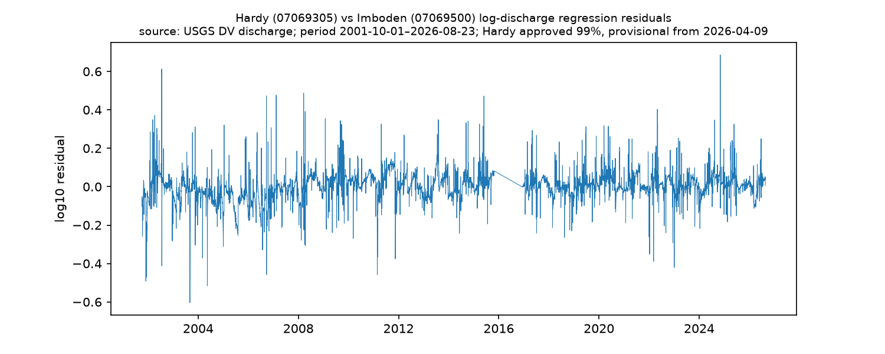

# QA report — generated 2026-08-24

## Hardy discharge

- rows: 9083; span 2001-10-01 → 2026-08-23
- approved fraction: 0.985; provisional from 2026-04-09 00:00:00
- gaps > 7 days: 0

(none)

## Imboden discharge

- rows: 13915; span 1981-01-01 → 2026-08-23
- approved fraction: 0.988; provisional from 2026-03-10 00:00:00
- gaps > 7 days: 2

| gap_start           | gap_end             |   days |
|:--------------------|:--------------------|-------:|
| 1995-05-11 00:00:00 | 2001-09-30 00:00:00 |   2335 |
| 2015-10-27 00:00:00 | 2016-12-14 00:00:00 |    415 |

## Hardy stage (daily max of IV)

- rows: 6858; span 2007-10-01 → 2026-08-24
- approved fraction: 0.980; provisional from 2026-04-09 00:00:00
- gaps > 7 days: 2

| gap_start           | gap_end             |   days |
|:--------------------|:--------------------|-------:|
| 2014-07-08 00:00:00 | 2014-07-20 00:00:00 |     13 |
| 2014-08-10 00:00:00 | 2014-08-18 00:00:00 |      9 |

## Hardy vs Imboden cross-check

- overlap days: 8666; |z| > 4 flagged days: 63

| date                |   hardy |   imboden |   residual |
|:--------------------|--------:|----------:|-----------:|
| 2001-11-29 00:00:00 |     550 |      2470 |  -0.490073 |
| 2001-11-30 00:00:00 |     604 |      2760 |  -0.491959 |
| 2001-12-01 00:00:00 |     447 |      1150 |  -0.287047 |
| 2001-12-08 00:00:00 |     351 |      1410 |  -0.470192 |
| 2001-12-13 00:00:00 |     356 |       890 |  -0.287645 |
| 2002-01-31 00:00:00 |    4500 |      3540 |   0.284794 |
| 2002-03-09 00:00:00 |    6080 |      4210 |   0.34903  |
| 2002-03-19 00:00:00 |    6530 |      5420 |   0.283184 |
| 2002-04-08 00:00:00 |    6680 |      4420 |   0.371241 |
| 2002-05-08 00:00:00 |    3770 |      2750 |   0.304737 |
| 2002-07-18 00:00:00 |    2530 |       785 |   0.612155 |
| 2002-07-19 00:00:00 |    5590 |      2150 |   0.570171 |
| 2002-07-20 00:00:00 |    2220 |      9810 |  -0.41284  |
| 2002-12-19 00:00:00 |     561 |      1470 |  -0.282513 |
| 2003-09-02 00:00:00 |    1140 |      7590 |  -0.603923 |
| 2003-09-03 00:00:00 |    1220 |      4090 |  -0.337427 |
| 2003-10-10 00:00:00 |    1720 |      1200 |   0.281857 |
| 2003-11-18 00:00:00 |   20700 |     18600 |   0.311503 |
| 2003-11-19 00:00:00 |    6850 |     26500 |  -0.304488 |
| 2004-03-05 00:00:00 |    1070 |      3850 |  -0.371219 |
| 2004-05-14 00:00:00 |    2470 |     14500 |  -0.516302 |
| 2005-01-02 00:00:00 |     474 |      1310 |  -0.311518 |
| 2005-01-13 00:00:00 |    7660 |      5880 |   0.321269 |
| 2006-05-10 00:00:00 |    3090 |      2330 |   0.281893 |
| 2006-07-28 00:00:00 |     362 |      1010 |  -0.328879 |
| 2006-09-22 00:00:00 |    1140 |       457 |   0.47335  |
| 2006-09-24 00:00:00 |    2620 |     13300 |  -0.45758  |
| 2006-11-30 00:00:00 |    2310 |      1570 |   0.306904 |
| 2007-02-12 00:00:00 |    3100 |      1410 |   0.475862 |
| 2008-03-18 00:00:00 |   24900 |     14500 |   0.4872   |
| 2008-04-02 00:00:00 |    5380 |     20000 |  -0.301507 |
| 2008-04-05 00:00:00 |    6180 |     22100 |  -0.27958  |
| 2008-04-10 00:00:00 |   37400 |     29500 |   0.391577 |
| 2008-04-12 00:00:00 |    5240 |     19700 |  -0.307164 |
| 2009-01-28 00:00:00 |    1700 |       979 |   0.354813 |
| 2009-09-05 00:00:00 |     999 |       552 |   0.343603 |
| 2009-09-22 00:00:00 |    4410 |      3120 |   0.324439 |
| 2011-02-24 00:00:00 |     712 |      2610 |  -0.399092 |
| 2011-02-25 00:00:00 |     902 |      3980 |  -0.458128 |
| 2011-02-28 00:00:00 |     683 |      2290 |  -0.367006 |
| 2011-04-24 00:00:00 |   13700 |     11200 |   0.326724 |
| 2011-11-15 00:00:00 |     830 |      2920 |  -0.375523 |
| 2011-11-16 00:00:00 |    1010 |      2840 |  -0.279629 |
| 2013-08-04 00:00:00 |     933 |       504 |   0.348796 |
| 2013-08-05 00:00:00 |    2950 |      2200 |   0.283767 |
| 2014-09-11 00:00:00 |    2970 |      1950 |   0.332949 |
| 2014-10-11 00:00:00 |    3240 |      2100 |   0.342325 |
| 2015-03-26 00:00:00 |   10100 |      7930 |   0.326693 |
| 2015-05-16 00:00:00 |    4740 |      3470 |   0.315016 |
| 2015-05-30 00:00:00 |    7230 |      3720 |   0.471705 |
| 2017-05-04 00:00:00 |   12100 |     10600 |   0.293898 |
| 2019-06-26 00:00:00 |    2920 |      2020 |   0.312054 |
| 2020-03-14 00:00:00 |    3720 |      2620 |   0.317504 |
| 2020-05-17 00:00:00 |   11600 |      9570 |   0.314761 |
| 2022-01-09 00:00:00 |    1020 |      3460 |  -0.351055 |
| 2022-03-07 00:00:00 |    2000 |      8200 |  -0.389435 |
| 2022-05-02 00:00:00 |    4240 |      2430 |   0.40319  |
| 2022-05-05 00:00:00 |    9490 |      7280 |   0.332426 |
| 2022-12-14 00:00:00 |    1350 |      4080 |  -0.292514 |
| 2023-01-03 00:00:00 |    1580 |      6810 |  -0.420597 |
| 2024-08-14 00:00:00 |    2320 |      1420 |   0.347279 |
| 2024-11-04 00:00:00 |   13300 |      4240 |   0.686256 |
| 2025-05-24 00:00:00 |    6670 |      4970 |   0.325627 |

## Precip homogeneity

### KUNO

- rows: 16672; span 1981-01-01 → 2026-08-24
- NaN days: 6341
- gaps > 7 days: 2

| gap_start           | gap_end             |   days |
|:--------------------|:--------------------|-------:|
| 1981-01-01 00:00:00 | 1998-03-31 00:00:00 |   6299 |
| 2013-06-08 00:00:00 | 2013-06-18 00:00:00 |     11 |

### USC00238880

- rows: 16672; span 1981-01-01 → 2026-08-24
- NaN days: 1046
- gaps > 7 days: 32

| gap_start           | gap_end             |   days |
|:--------------------|:--------------------|-------:|
| 1987-02-13 00:00:00 | 1987-02-28 00:00:00 |     16 |
| 1992-08-01 00:00:00 | 1992-08-31 00:00:00 |     31 |
| 1995-12-20 00:00:00 | 1995-12-31 00:00:00 |     12 |
| 1996-10-09 00:00:00 | 1996-10-19 00:00:00 |     11 |
| 1997-04-12 00:00:00 | 1997-04-21 00:00:00 |     10 |
| 1997-05-31 00:00:00 | 1997-06-09 00:00:00 |     10 |
| 1997-08-20 00:00:00 | 1997-08-30 00:00:00 |     11 |
| 2001-07-13 00:00:00 | 2001-07-23 00:00:00 |     11 |
| 2011-04-04 00:00:00 | 2011-05-03 00:00:00 |     30 |
| 2011-05-20 00:00:00 | 2011-05-28 00:00:00 |      9 |
| 2011-05-31 00:00:00 | 2011-06-09 00:00:00 |     10 |
| 2011-08-10 00:00:00 | 2011-08-20 00:00:00 |     11 |
| 2011-10-30 00:00:00 | 2011-11-07 00:00:00 |      9 |
| 2012-01-12 00:00:00 | 2012-01-19 00:00:00 |      8 |
| 2012-03-18 00:00:00 | 2012-03-28 00:00:00 |     11 |
| 2012-09-23 00:00:00 | 2012-10-01 00:00:00 |      9 |
| 2013-01-10 00:00:00 | 2013-02-01 00:00:00 |     23 |
| 2013-05-13 00:00:00 | 2013-05-21 00:00:00 |      9 |
| 2013-09-28 00:00:00 | 2013-10-07 00:00:00 |     10 |
| 2013-11-19 00:00:00 | 2013-11-26 00:00:00 |      8 |
| 2014-04-10 00:00:00 | 2014-04-17 00:00:00 |      8 |
| 2015-02-16 00:00:00 | 2015-03-11 00:00:00 |     24 |
| 2016-01-30 00:00:00 | 2016-02-06 00:00:00 |      8 |
| 2016-02-08 00:00:00 | 2016-02-20 00:00:00 |     13 |
| 2017-03-13 00:00:00 | 2017-03-25 00:00:00 |     13 |
| 2017-09-10 00:00:00 | 2017-09-18 00:00:00 |      9 |
| 2019-02-10 00:00:00 | 2019-02-19 00:00:00 |     10 |
| 2019-05-01 00:00:00 | 2019-05-08 00:00:00 |      8 |
| 2019-06-25 00:00:00 | 2019-07-03 00:00:00 |      9 |
| 2020-10-05 00:00:00 | 2020-10-18 00:00:00 |     14 |
| 2021-04-14 00:00:00 | 2021-04-22 00:00:00 |      9 |
| 2026-07-09 00:00:00 | 2026-07-19 00:00:00 |     11 |

### KUNO vs USC00238880 overlap

- overlap days: 9540
- correlation: 0.42
- mean ratio (USC00238880/KUNO): 1.10

Daily correlation between an ASOS calendar-day series and a COOP station whose observation day ends ~7 AM is expected to be depressed by the observation-time offset; Phase 4 should compare on multi-day or monthly aggregates before treating this as a data-quality problem.
