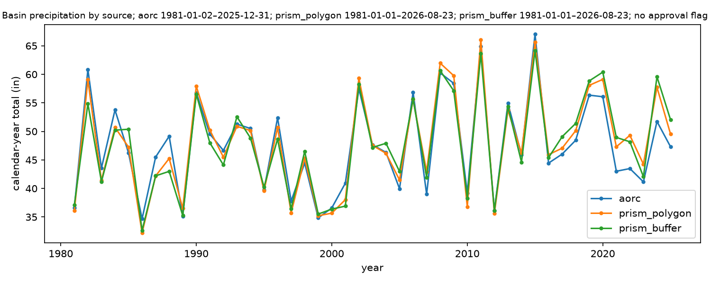

```{python}
#| include: false
import re
from pathlib import Path

import numpy as np
import pandas as pd
from IPython.display import Markdown

from spring_river.stats.trends import trend_test

T = Path("tables")
D = Path("../docs")


def tbl(name: str) -> pd.DataFrame:
    return pd.read_parquet(T / f"{name}.parquet")


def doc(name: str) -> str:
    return (D / f"{name}.md").read_text()


def section(text: str, header: str) -> str:
    """Text of a markdown section: from `header` to the next header of the same or higher level."""
    level = len(header) - len(header.lstrip("#"))
    lines = text.splitlines()
    start = next(i for i, l in enumerate(lines) if l.strip().startswith(header))
    out = []
    for l in lines[start + 1:]:
        m = re.match(r"^(#+) ", l)
        if m and len(m[1]) <= level:
            break
        out.append(l)
    return "\n".join(out)


TREND_RE = r"Sen slope (\S+) .*?\(95% CI (\S+) to (\S+)\); MK z=(\S+), p=(\S+); n=(\d+)"


def doc_trend(text: str, prefix: str) -> dict:
    """Parse a phase-report trend line ('- <prefix>: Sen slope ... n=..') into numbers."""
    for line in text.splitlines():
        s = line.strip().lstrip("-").strip().strip("*")
        if s.startswith(prefix):
            m = re.search(TREND_RE, s)
            if m:
                return dict(slope=float(m[1]), lo=float(m[2]), hi=float(m[3]),
                            z=float(m[4]), p=float(m[5]), n=int(m[6]))
    raise KeyError(prefix)


def doc_re(text: str, pattern: str, cast=float, group: int = 1):
    m = re.search(pattern, text)
    if not m:
        raise KeyError(pattern)
    return cast(m[group])


def md_table(text: str, first_col: str) -> pd.DataFrame:
    """Parse the first pipe table in `text` whose header starts with `first_col`."""
    lines = text.splitlines()
    i = next(k for k, l in enumerate(lines) if l.strip().startswith(f"| {first_col}"))
    rows = []
    for l in lines[i:]:
        if not l.strip().startswith("|"):
            break
        rows.append([c.strip() for c in l.strip().strip("|").split("|")])
    hdr, body = rows[0], [r for r in rows[2:]]
    return pd.DataFrame(body, columns=hdr)


def g(x: float, sig: int = 3) -> str:
    return f"{x:.{sig}g}"


def pm(x: float) -> str:
    return f"{x:+.3g}"


def trend_str(r: dict, unit: str, per: str = "yr", sig: int = 3) -> str:
    return (f"Sen slope {r['slope']:.{sig}g} {unit}/{per} (95% CI {r['lo']:.{sig}g} to {r['hi']:.{sig}g}); "
            f"MK z={r['z']:.2f}, p={r['p']:.3f}; n={r['n']}")


def tr(r) -> dict:
    return dict(slope=r.slope, lo=r.slope_lo, hi=r.slope_hi, z=r.z, p=r.p, n=r.n)


def show(df: pd.DataFrame, floatfmt=".3g") -> Markdown:
    return Markdown(df.to_markdown(index=False, floatfmt=floatfmt))


# ---------------------------------------------------------------- docs
P4, P5, P6, QA, RES = (doc("phase4_baseflow"), doc("phase5_floods"), doc("phase6_precip"),
                       doc("qa_report"), doc("../spring_river_research"))

# ---------------------------------------------------------------- QA numbers
qa_hardy = section(QA, "## Hardy discharge")
qa_imb = section(QA, "## Imboden discharge")
qa_stage = section(QA, "## Hardy stage")
qa_mam = section(QA, "## Mammoth Spring vent discharge")
qa_x = section(QA, "## Hardy vs Imboden cross-check")
qa_coop = section(QA, "### USC00238880")
qa_kuno = section(QA, "### KUNO")
qa_ovl = section(QA, "### KUNO vs USC00238880 overlap")


def qa_row(sec: str, label: str) -> dict:
    return dict(
        series=label,
        rows=doc_re(sec, r"rows: (\d+)", int),
        span=doc_re(sec, r"span (\S+ → \S+)", str),
        approved=doc_re(sec, r"approved fraction: ([\d.]+)") if "approved fraction" in sec else "n/a (no flag)",
        provisional_from=doc_re(sec, r"provisional from (\d{4}-\d{2}-\d{2})", str) if "provisional from" in sec else "n/a",
        gaps_gt7d=doc_re(sec, r"gaps > 7 days: (\d+)", int),
    )


qa_df = pd.DataFrame([
    qa_row(qa_hardy, "Hardy DV discharge 07069305"),
    qa_row(qa_imb, "Imboden DV discharge 07069500"),
    qa_row(qa_stage, "Hardy daily-max IV stage 07069305"),
    qa_row(qa_mam, "Mammoth Spring DV discharge 07069190"),
    qa_row(qa_kuno, "KUNO ASOS precip"),
    qa_row(qa_coop, "USC00238880 COOP precip"),
])
hardy_approved = qa_df.loc[0, "approved"]
mam_approved = qa_df.loc[3, "approved"]
xcheck_overlap = doc_re(qa_x, r"overlap days: (\d+)", int)
xcheck_flag = doc_re(qa_x, r"flagged days: (\d+)", int)
daily_r = doc_re(qa_ovl, r"correlation: (\S+)")
coop_gaps = qa_df.loc[5, "gaps_gt7d"]

# ---------------------------------------------------------------- Phase 4: base flow
att = {s: tbl(f"phase4_attribution_{s}") for s in ("hardy", "mammoth")}


def min7_trend(df: pd.DataFrame) -> dict:
    d = df[df["complete"] & (df["min7_cfs"] > 0)].dropna(subset=["p_trailing_in", "p_trailing_prev_in", "oni_trailing"])
    return tr(trend_test(np.log(d["min7_cfs"].to_numpy()), d["wy"].to_numpy(dtype=float)))


min7 = {s: min7_trend(att[s]) for s in att}          # from tables
q1 = section(P4, "## Q1 attribution")
q1_sec = {"mammoth": section(q1, "### Mammoth"), "hardy": section(q1, "### Hardy")}
resid = {s: doc_trend(q1_sec[s], "Residual trend") for s in q1_sec}
ols_r2 = {s: doc_re(q1_sec[s], r"R²=(\S+), n=") for s in q1_sec}
ols_n = {s: doc_re(q1_sec[s], r"R²=\S+, n=(\d+)", int) for s in q1_sec}
ols_coef = {s: {k: (doc_re(q1_sec[s], rf"{k}: (\S+) \(95% CI"), doc_re(q1_sec[s], rf"{k}: \S+ \(95% CI (\S+) to"),
                    doc_re(q1_sec[s], rf"{k}: \S+ \(95% CI \S+ to (\S+)\)"))
                for k in ("p_trailing_in", "p_trailing_prev_in", "oni_trailing")} for s in q1_sec}
pettitt = {s: (doc_re(q1_sec[s], r"Pettitt change-point on min7: after WY (\d+)", int),
               doc_re(q1_sec[s], r"Pettitt change-point on min7: after WY \d+ \(K=\d+, p=(\S+),")) for s in q1_sec}
bfi_sec = section(P4, "### BFI trend")
bfi = {("mammoth", "eckhardt"): doc_trend(bfi_sec, "Mammoth BFI (eckhardt):"),
       ("hardy", "eckhardt"): doc_trend(bfi_sec, "Hardy BFI (eckhardt):"),
       ("mammoth", "lyne_hollick"): doc_trend(bfi_sec, "Mammoth BFI (lyne_hollick):"),
       ("hardy", "lyne_hollick"): doc_trend(bfi_sec, "Hardy BFI (lyne_hollick):")}
series_cap = {s: re.search(r"Series: (source: [^\n]*)", q1_sec[s])[1] for s in q1_sec}

rd = tbl("phase4_rating_drift")
rating = {int(f): tr(trend_test(rd.loc[rd["flow_cfs"] == f, "stage_at_flow_ft"].to_numpy(),
                                 rd.loc[rd["flow_cfs"] == f, "wy"].to_numpy(dtype=float)))
          for f in (400.0, 1000.0)}
rating_wide = rd.pivot(index="wy", columns="flow_cfs", values="stage_at_flow_ft").reset_index()
rating_wide.columns = ["WY", "stage @400 cfs (ft)", "stage @1000 cfs (ft)"]
q5 = section(P4, "## Q5 rating drift")
rating_pairs_n = doc_re(q5, r"n=(\d+) matched 15-min pairs", int)
rating_pairs_cap = re.search(r"Pairs: (source: [^;]*; period [^;]*; approved [^;]*)", q5)[1]
shift_tbl = md_table(q5, "event_date")
shift_tbl["shift_ft"] = shift_tbl["shift_ft"].astype(float)
shift_min, shift_max = shift_tbl["shift_ft"].min(), shift_tbl["shift_ft"].max()

rtab = tbl("phase4_rating_table")
rfit = tbl("phase4_rating_fit").iloc[0]
rpct = tbl("phase4_rating_percentiles")
rt_w = rtab.pivot(index="stage_ft", columns="variant", values=["median_cfs", "n_pairs"])
rt_w = rt_w.loc[rt_w[("median_cfs", "whole_record")].notna()]


def cfs_or_dash(v: float) -> str:
    return "—" if np.isnan(v) else f"{v:,.0f}"


rt_show = pd.DataFrame({
    "stage (ft)": [f"{s:.1f}" for s in rt_w.index],
    "whole-record median (cfs)": [cfs_or_dash(v) for v in rt_w[("median_cfs", "whole_record")]],
    "recent median (cfs)": [cfs_or_dash(v) for v in rt_w[("median_cfs", "recent")]],
    "n whole-record": [f"{int(v):,}" for v in rt_w[("n_pairs", "whole_record")]],
    "n recent": [f"{int(v):,}" for v in rt_w[("n_pairs", "recent")]],
})
rt_ratio = (rt_w[("median_cfs", "recent")] / rt_w[("median_cfs", "whole_record")] - 1).dropna()
rt_low = rt_ratio.loc[rt_ratio.index <= 4.0]            # low-end (paddling) stages with both variants
rt_hi_ok = rt_ratio.loc[rt_ratio.index >= 6.0]
rpct_show = pd.DataFrame({
    "Hardy DV percentile": rpct["percentile"].astype(int),
    "flow (cfs)": [f"{v:,.0f}" for v in rpct["q_cfs"]],
    "recent stage (ft)": [f"{v:.2f}" for v in rpct["stage_ft"]],
    "n pairs ±3 %": [f"{int(v):,}" for v in rpct["n_pairs"]],
})
pct_row = {int(r["percentile"]): r for _, r in rpct.iterrows()}
paddle_span_ft = pct_row[95]["stage_ft"] - pct_row[5]["stage_ft"]

pf = {s: tbl(f"phase4_postflood_{s}") for s in ("hardy", "mammoth")}
q4 = section(P4, "## Q4 post-flood")
q4_sec = {"mammoth": section(q4, "### Mammoth"), "hardy": section(q4, "### Hardy")}
pf_mean = {s: pf[s]["diff_pct"].mean() for s in pf}                                   # from tables
pf_ci = {s: (doc_re(q4_sec[s], r"bootstrap 95% CI (\S+) to"), doc_re(q4_sec[s], r"bootstrap 95% CI \S+ to (\S+)\)"))
         for s in q4_sec}
pf_controls = {s: doc_re(q4_sec[s], r"(\d+) unique control years", int) for s in q4_sec}
pf_n = {s: len(pf[s]) for s in pf}

# ---------------------------------------------------------------- Phase 5: floods
lp3 = {k: tbl(f"phase5_lp3_{k}") for k in ("hardy", "hardy_station_skew_only", "imboden", "imboden_wy_lt2008", "imboden_wy_ge2008")}
q8 = section(P5, "## Q8 LP3")
LP3_HDR = r"### {label} \(n=(\d+), WY (\d+)–(\d+), station skew (\S+), weighted skew (\S+); low outliers flagged below (\d+) cfs: (\d+)"


def lp3_meta(text: str, label: str) -> dict:
    m = re.search(LP3_HDR.format(label=re.escape(label)), text)
    return dict(series=label, n=int(m[1]), wy_start=int(m[2]), wy_end=int(m[3]), station_skew=float(m[4]),
                weighted_skew=float(m[5]), gb_threshold_cfs=int(m[6]), low_outliers_flagged=int(m[7]))


lp3_meta_df = pd.DataFrame([lp3_meta(q8, "Hardy"), lp3_meta(q8, "Hardy — station skew only"), lp3_meta(q8, "Imboden"),
                            lp3_meta(P5, "Imboden WY <2008"), lp3_meta(P5, "Imboden WY ≥2008")])
regional_skew = doc_re(q8, r"Regional skew (\S+) \(approximate")
n_boot = doc_re(q8, r"(\d+) resamples", int)


def q_at(df: pd.DataFrame, rp: float) -> tuple[float, float, float]:
    r = df.loc[np.isclose(df["return_period"], rp)].iloc[0]
    return float(r["q_cfs"]), float(r["q_lo"]), float(r["q_hi"])


h10 = q_at(lp3["hardy"], 10)
h100 = q_at(lp3["hardy"], 100)
i100 = q_at(lp3["imboden"], 100)
pre10, post10 = q_at(lp3["imboden_wy_lt2008"], 10), q_at(lp3["imboden_wy_ge2008"], 10)
split_overlap = (pre10[1] <= post10[2]) and (post10[1] <= pre10[2])

rp = tbl("phase5_return_periods_stage")
rp_show = rp.copy()
rp_show["empirical_return_period_yr"] = rp_show["empirical_return_period_yr"].map(lambda v: ">24" if np.isinf(v) else f"{v:.1f}")
rp_show.columns = ["stage (ft)", "flow (cfs)", "LP3 return period (yr)", "annual-peak exceedances WY 2002–2025",
                   "empirical return period (yr)", "NWS crests ≥ stage 1982–2025"]


def rp_row(stage: float) -> pd.Series:
    return rp.loc[np.isclose(rp["stage_ft"], stage)].iloc[0]


rp8, rp10, rp14, rp16, rp20, rp23 = (rp_row(s) for s in (8, 10, 14, 16, 20, 23))
sf_a, sf_b, sf_r2 = (doc_re(q8, r"log10 Q = (\S+) \+ (\S+)·log10 H \(R²=(\S+)\)", group=k) for k in (1, 2, 3))

q2 = section(P5, "## Q2 stationarity")
peak_trend = {"hardy": doc_trend(q2, "Hardy annual peaks"), "imboden": doc_trend(q2, "Imboden annual peaks")}
peak_pettitt = {"hardy": doc_re(q2, r"Hardy annual peaks.*?Pettitt change after WY (\d+) \(p=(\S+)\)", str, 1),
                "imboden": doc_re(q2, r"Imboden annual peaks.*?Pettitt change after WY (\d+) \(p=(\S+)\)", str, 1)}
verdict = section(P5, "## Stationarity verdict")
verdict_text = doc_re(verdict, r"\*\*Verdict: ([^*]+)\*\*", str)

pot = tbl("phase5_pot_counts").reset_index()
pot_sec = section(P5, "## Partial-duration series")
POT_RE = (r"≥(\d+) ft \(all\): (\d+) events over complete WY (\d+)–(\d+) \(n=(\d+)\); mean (\S+)/yr; "
          r"dispersion (\S+) \(p=(\S+)\); count trend " + TREND_RE)
pot_rows = []
for m in re.finditer(POT_RE, pot_sec):
    pot_rows.append(dict(threshold_ft=int(m[1]), events=int(m[2]), wy_start=int(m[3]), wy_end=int(m[4]), n_years=int(m[5]),
                         mean_per_yr=float(m[6]), dispersion=float(m[7]), dispersion_p=float(m[8]),
                         count_trend=f"{m[9]} events/yr (95% CI {m[10]} to {m[11]}); MK z={m[12]}, p={m[13]}; n={m[14]}"))
pot_df = pd.DataFrame(pot_rows)
pot16 = pot_df.loc[pot_df["threshold_ft"] == 16].iloc[0]
pot8 = pot_df.loc[pot_df["threshold_ft"] == 8].iloc[0]
complete_wy = pot.loc[(pot["wy"] >= pot8["wy_start"]) & (pot["wy"] <= pot8["wy_end"])]
pot_table_ok = int(complete_wy["ge_16ft_all"].sum()) == int(pot16["events"])

q6 = section(P5, "## Q6 inter-arrival")
Q6_RE = r"{label}: n=(\d+), mean gap (\S+) yr, median (\S+), CV (\S+); KS vs exponential (\S+), bootstrap p=(\S+)"


def q6_row(label: str) -> dict:
    m = re.search(Q6_RE.format(label=re.escape(label)), q6)
    return dict(series=label, n=int(m[1]), mean_gap_yr=float(m[2]), median_gap_yr=float(m[3]), cv=float(m[4]),
                ks=float(m[5]), bootstrap_p=float(m[6]))


q6_df = pd.DataFrame([q6_row("2002–present"), q6_row("with 1982 crest")])
q6_main = q6_df.iloc[0]
q6_events = doc_re(q6, r"WY ≥2008\): ([^\n]+)", str)

q7 = section(P5, "## Q7 quiet year")
q7_cond = doc_re(q7, r"P\(quiet \| prior major\) = (\S+) vs")
q7_base = doc_re(q7, r"vs base rate (\S+);")
q7_lo, q7_hi = doc_re(q7, r"base rate: (\S+) to"), doc_re(q7, r"base rate: \S+ to (\S+)\)")
q7_perm = doc_re(q7, r"permutation p=(\S+);")
q7_nmaj = doc_re(q7, r"n_major=(\d+)", int)
q7_ny = doc_re(q7, r"n_years=(\d+)", int)

ante = md_table(section(P5, "## Antecedent conditions"), "event_date")
ante["event_date"] = ante["event_date"].str.slice(0, 10)
for c in ante.columns[1:]:
    ante[c] = ante[c].astype(float)

# ---------------------------------------------------------------- Phase 6: precipitation
it = tbl("phase6_index_trends")
idx = {k: tbl(f"phase6_indices_{k}") for k in ("basin", "USC00238880", "KUNO", "USC00230127")}
INDEX_LABELS = {"total_in": "annual total (in)", "recharge_in": "Sep–Feb recharge-season total (in)",
                "growing_in": "growing-season total (in)", "days_ge_0p5": "days ≥ 0.5 in", "days_ge_1": "days ≥ 1 in",
                "days_ge_2": "days ≥ 2 in", "max1_in": "max 1-day (in)", "max3_in": "max 3-day (in)",
                "top5_frac": "top-5-day fraction of annual", "sdii_in": "SDII (in/wet day)"}


def trend_row(series: str, index: str) -> pd.Series:
    return it.loc[(it["series"] == series) & (it["index"] == index)].iloc[0]


def idx_trend(series: str, index: str) -> dict:
    r = trend_row(series, index)
    return dict(slope=r["slope_per_decade"], lo=r["lo"], hi=r["hi"], z=r["z"], p=r["p"], n=int(r["n"]))


basin_total = idx_trend("basin", "total_in")
basin_recharge = idx_trend("basin", "recharge_in")
basin_sdii = idx_trend("basin", "sdii_in")
basin_days1 = idx_trend("basin", "days_ge_1")
basin_max1 = idx_trend("basin", "max1_in")
kuno_sdii = idx_trend("KUNO", "sdii_in")
coop_max3 = idx_trend("USC00238880", "max3_in")
sig_count = it.groupby("series")["significant_bh"].sum().astype(int).to_dict()
n_index = int(it.groupby("series")["index"].count().iloc[0])


def years_passing(df: pd.DataFrame) -> int:
    return int(((df["year"] <= 2025) & (df["coverage"] >= 0.9)).sum())


coop_fail_years = idx["USC00238880"].loc[(idx["USC00238880"]["year"] <= 2025) & (idx["USC00238880"]["coverage"] < 0.9), "year"].tolist()
coop_fail_recent = [y for y in coop_fail_years if y >= 2011]
basin_mean_total = idx["basin"].loc[idx["basin"]["year"] <= 2025, "total_in"].mean()
basin_mean_recharge = idx["basin"].loc[idx["basin"]["year"] <= 2025, "recharge_in"].mean()
basin_recharge_frac = basin_mean_recharge / basin_mean_total

it_show = it.assign(index=it["index"].map(INDEX_LABELS))[["series", "index", "n", "slope_per_decade", "lo", "hi", "z", "p_bh", "significant_bh"]]
it_show.columns = ["series", "index", "n (yr)", "Sen slope / decade", "CI lo", "CI hi", "MK z", "p (BH)", "BH-significant"]

agree = section(P6, "## Station agreement")
monthly_r = doc_re(agree, r"r=(\S+), ratio")
monthly_ratio = doc_re(agree, r"ratio COOP/KUNO=(\S+),")
monthly_n = doc_re(agree, r"n=(\d+) months", int)

lag = tbl("phase6_lag_correlation")
lag_all = lag.loc[lag["variant"] == "all"].reset_index(drop=True)
lag_appr = lag.loc[lag["variant"] == "approved"].reset_index(drop=True)
best = lag_all.loc[lag_all["r"].idxmax()]
best_appr = lag_appr.loc[lag_appr["r"].idxmax()]
lag0 = lag_all.loc[lag_all["lag"] == 0].iloc[0]
lag_zero_cross = int(lag_all.loc[lag_all["r_lo"] <= 0, "lag"].min())
lag_cap = re.search(r"!\[lag\][^\n]*\n\nFigure: ([^\n]*)", P6)[1]
idx_cap = re.search(r"!\[indices\][^\n]*\n\nFigure: ([^\n]*)", P6)[1]

# ---------------------------------------------------------------- Phase 7: seasonality and recession
P7 = doc("phase7_seasonality")
pt = tbl("phase7_peak_timing")
pt_series = list(dict.fromkeys(pt["series"]))
pt_all = pt.loc[pt["period"] == "all"].set_index("series")
pt_dec = pt.loc[pt["period"] != "all"]
pt_show = pt[["series", "period", "n", "mean_date_label", "R", "rayleigh_p"]].rename(
    columns={"mean_date_label": "mean date", "rayleigh_p": "Rayleigh p"})
pt_sec = {s: section(P7, f"### {s}") for s in pt_series}
pt_cap = {s: re.search(r"source: [^\n]*", pt_sec[s])[0] for s in pt_series}
PT_HARDY_POT, PT_HARDY, PT_IMBODEN = pt_series


def pt_str(s: str) -> str:
    r = pt_all.loc[s]
    return f"n = {int(r['n'])}, mean date {r['mean_date_label']}, R = {r['R']:.2f}, Rayleigh p = {r['rayleigh_p']:.4f}"


def pt_decade_range(s: str) -> str:
    d = pt_dec.loc[pt_dec["series"] == s]
    lo, hi = d.loc[d["mean_doy"].idxmin()], d.loc[d["mean_doy"].idxmax()]
    return f"{lo['mean_date_label']} ({lo['period']}) to {hi['mean_date_label']} ({hi['period']})"


rk = {s: tbl(f"phase7_recession_k_{s}") for s in ("hardy", "mammoth")}
rk_fit = {s: d.dropna(subset=["k_days"]) for s, d in rk.items()}
rk_trend = {s: tr(trend_test(d["k_days"].to_numpy(), d["wy"].to_numpy())) for s, d in rk_fit.items()}
rk_stats = {s: dict(events=len(rk[s]), fitted=len(d), median=d["k_days"].median(),
                    q25=d["k_days"].quantile(0.25), q75=d["k_days"].quantile(0.75), r2=d["r2"].median())
            for s, d in rk_fit.items()}
rec_sec = {"hardy": section(P7, "### Hardy ("), "mammoth": section(P7, "### Mammoth Spring (")}
rec_label = {"hardy": "Hardy", "mammoth": "Mammoth Spring"}
rec_params = {s: doc_re(P7, rf"### {rec_label[s]} \(([^)]*)\)", str) for s in rec_sec}
rec_cap = {s: re.search(r"source: [^\n]*", rec_sec[s])[0] for s in rec_sec}
rec_doc_trend = {s: doc_trend(rec_sec[s], f"{rec_label[s]} k (days/yr) (all)") for s in rec_sec}
rec_appr_trend = {s: doc_trend(rec_sec[s], f"{rec_label[s]} k (days/yr) (approved-only)") for s in rec_sec}
for s in rec_sec:  # parquet-computed trend must equal the phase report's
    assert abs(rk_trend[s]["slope"] - rec_doc_trend[s]["slope"]) < 5e-4 and rk_trend[s]["n"] == rec_doc_trend[s]["n"], s
rec_identical = all(rec_appr_trend[s] == rec_doc_trend[s] for s in rec_sec)
PETT_RE = r"Pettitt change-point in k: after (\S+) \(WY (\d+); K=(\d+), p=([\d.]+), n=(\d+)\)"
rec_pett = {s: dict(zip(("date", "wy", "K", "p", "n"), re.search(PETT_RE, rec_sec[s]).groups())) for s in rec_sec}
mr = {s: tbl(f"phase7_master_recession_{s}") for s in ("hardy", "mammoth")}
mr_end = {s: (int(d["t_days"].max()), int(d["n"].iloc[-1])) for s, d in mr.items()}

# ---------------------------------------------------------------- Annual ledger (Phase 3)
ledger = pd.read_parquet("../data/processed/annual_ledger.parquet")
ledger_complete = ledger.loc[ledger["complete"]]
ledger_span = (int(ledger["wy"].min()), int(ledger["wy"].max()))

# ---------------------------------------------------------------- basin-source comparison (2nd edition)
cmp = tbl("precip_source_comparison")


def cmp_val(source, block, metric):
    return cmp[(cmp.source == source) & (cmp.block == block) & (cmp.metric == metric)].iloc[0]


agree = cmp_val("aorc vs prism_polygon", "agreement", "annual_total_r")
ratio = cmp_val("aorc vs prism_polygon", "agreement", "annual_total_ratio")
```

# Abstract

Spring River at Hardy, AR (USGS 07069305) is a spring-fed Ozark river whose base flow is set by Mammoth Spring (07069190) and whose floods are set by basin rainfall. Over the systematic record (Hardy WY `{python} int(att['hardy']['wy'].min())`–`{python} int(att['hardy']['wy'].max())`, Mammoth WY `{python} int(att['mammoth']['wy'].min())`–`{python} int(att['mammoth']['wy'].max())`; `{python} f"{hardy_approved:.1%}"` of Hardy daily discharge approved) the 7-day annual low flow at Hardy rose (`{python} trend_str(min7['hardy'], 'log-cfs')`), but antecedent precipitation and ENSO explain it (OLS R² = `{python} g(ols_r2['hardy'], 2)`, n = `{python} ols_n['hardy']`) and the non-climatic residual trend is indistinguishable from zero at Mammoth Spring, the 1981+ primary series (`{python} trend_str(resid['mammoth'], 'log-cfs')`). At Hardy the residual is positive on this edition's primary basin series (`{python} trend_str(resid['hardy'], 'log-cfs')`) but its CI spans zero on both PRISM basin series (§7.1) — a source-dependent result at n = `{python} resid['hardy']['n']`, not a finding. Base flow after the `{python} pf_n['mammoth']` major (≥16 ft) floods was higher, not lower, than in precipitation- and antecedent-matched non-flood years (Mammoth `{python} f"{pf_mean['mammoth']:+.1f}%"`, bootstrap 95% CI `{python} g(pf_ci['mammoth'][0])` to `{python} g(pf_ci['mammoth'][1])`; Hardy `{python} f"{pf_mean['hardy']:+.1f}%"`, CI `{python} g(pf_ci['hardy'][0])` to `{python} g(pf_ci['hardy'][1])`; descriptive, not causal). The falling stage floor is largely a rating artifact: stage at 1000 cfs fell (`{python} trend_str(rating[1000], 'ft')`). Flood frequency shows no detectable change: Imboden annual peaks `{python} trend_str(peak_trend['imboden'], 'log10-cfs')`; the pre-/post-2008 10-yr quantiles (`{python} f"{pre10[0]:,.0f}"` vs `{python} f"{post10[0]:,.0f}"` cfs) have overlapping 5–95% bootstrap intervals. LP3 return periods at Hardy (n = `{python} int(lp3_meta_df.loc[0, 'n'])`) put 10 ft at `{python} g(rp10['lp3_return_period_yr'], 2)` yr, 16 ft at `{python} g(rp16['lp3_return_period_yr'], 2)` yr (empirical `{python} g(rp16['empirical_return_period_yr'], 2)`), 20 ft at `{python} g(rp20['lp3_return_period_yr'], 3)` yr and 23 ft at `{python} g(rp23['lp3_return_period_yr'], 2)` yr. Major-flood inter-arrivals are consistent with a memoryless process (CV `{python} g(q6_main['cv'])`, bootstrap p = `{python} g(q6_main['bootstrap_p'], 2)`, n = `{python} int(q6_main['n'])`). Basin (AORC, MoDNR recharge polygon) precipitation became more intense without becoming detectably wetter: `{python} sig_count['basin']`/`{python} n_index` indices are BH-significant, led by SDII (`{python} pm(basin_sdii['slope'])` in/wet-day/decade, 95% CI `{python} g(basin_sdii['lo'], 2)` to `{python} g(basin_sdii['hi'], 2)`) and max 1-day (`{python} pm(basin_max1['slope'])` in/decade, CI `{python} g(basin_max1['lo'], 2)` to `{python} g(basin_max1['hi'], 2)`), but the annual total is not (`{python} pm(basin_total['slope'])` in/decade, CI `{python} g(basin_total['lo'], 2)` to `{python} g(basin_total['hi'], 2)`, n = `{python} basin_total['n']`) and the Sep–Feb recharge-season total is flat to negative (`{python} pm(basin_recharge['slope'])` in/decade, CI `{python} g(basin_recharge['lo'], 2)` to `{python} g(basin_recharge['hi'], 2)`, n = `{python} basin_recharge['n']`). The first edition's significant annual-total rise was a property of the oversized 30 km buffer (§7.1). Monthly basin precipitation anomalies lead Mammoth Spring flow by `{python} int(best['lag'])` month (r = `{python} g(best['r'], 2)`, 95% CI `{python} g(best['r_lo'], 2)` to `{python} g(best['r_hi'], 2)`, n = `{python} int(best['n'])` months). Flood timing is a broad late-winter mode with no drift across decades (Imboden annual peaks mean date `{python} pt_all.loc[PT_IMBODEN, 'mean_date_label']`, R = `{python} f"{pt_all.loc[PT_IMBODEN, 'R']:.2f}"`, n = `{python} int(pt_all.loc[PT_IMBODEN, 'n'])`), and recession constants show no trend (Hardy median k `{python} f"{rk_stats['hardy']['median']:.0f}"` days, `{python} trend_str(rk_trend['hardy'], 'days')`; Mammoth Spring `{python} f"{rk_stats['mammoth']['median']:.0f}"` days, `{python} trend_str(rk_trend['mammoth'], 'days')`). No conclusion changed when provisional data were excluded.

# Setting

- **River gauge.** USGS 07069305 Spring River at Hardy, AR (NWS HDYA4). Daily discharge WY `{python} int(att['hardy']['wy'].min())`–present; 15-min stage from 2007-10-01; `{python} int(lp3_meta_df.loc[0, 'n'])` annual peaks (WY `{python} int(lp3_meta_df.loc[0, 'wy_start'])`–`{python} int(lp3_meta_df.loc[0, 'wy_end'])`). There is no USGS daily-stage product at Hardy; daily stage is the daily maximum of the instantaneous record.
- **Long flood record.** USGS 07069500 Spring River at Imboden, AR, downstream: daily discharge from 1936 and `{python} int(lp3_meta_df.loc[2, 'n'])` annual peaks (WY `{python} int(lp3_meta_df.loc[2, 'wy_start'])`–`{python} int(lp3_meta_df.loc[2, 'wy_end'])` in the NWIS peak file).
- **Spring.** USGS 07069190 Mammoth Spring at Mammoth Spring, AR: the vent gauge, daily discharge from 1981-02-25 with no gaps > 7 days. It carries the 1981+ base-flow record; Hardy is the WY 2002+ series.
- **Recharge basin.** The MoDNR / Missouri Geological Survey "Mammoth Spring Recharge Area" polygon (revised layer 2022-09-14; 361 mi² stated, ~349 mi² equal-area), south-east of West Plains toward Alton and Thayer. Basin precipitation is the NOAA AORC v1.1 1 km hourly analysis averaged over the polygon (daily totals are the 24 h ending 12 UTC); the AORC bucket ends at `2025.zarr`, so the basin series runs 1981-01-02 to 2025-12-31. PRISM 4 km over the same polygon is the second opinion and runs to within a day of today (§7.1). The first edition's 30 km West Plains buffer was ~3× the polygon's area and offset north-west. Station series: USC00238880 West Plains COOP (1981+ in this build), KUNO West Plains ASOS (1998-04+), USC00230127 Alton COOP (1981+ pulled, but no data 1983–1994 or 2012–2016, so `{python} idx_trend('USC00230127', 'total_in')['n']` years pass the coverage gate).
- **Flood categories (NWS HDYA4).** Action 8 ft, minor 10 ft, moderate 14 ft, major 16 ft. Record crest 29.0 ft on 1982-12-03 (flow not reported), before the systematic Hardy record.
- **Conventions.** Water year (Oct–Sep) for hydrologic statistics; calendar year for precipitation totals; recharge season Sep–Feb. No interpolation across gaps > 7 days. Every analysis is run on all data and on approved-only data; any conclusion that changes is flagged.

# Data and QA

Full gap maps, cross-check residuals and the deferred QA items are in [`docs/qa_report.md`](../docs/qa_report.md).

```{python}
#| label: tbl-qa
#| tbl-cap: "Series inventory and QA summary (from docs/qa_report.md, generated 2026-08-24). Gap boundaries are the first and last missing day."
show(qa_df, floatfmt=".3f")
```

- Hardy discharge has no gaps > 7 days; Imboden has two (1995–2001, 2015–2016) that are excluded, not filled. Hardy daily-max stage has two short 2014 gaps (13 and 9 days).
- Hardy vs Imboden log-ratio cross-check: `{python} f"{xcheck_overlap:,}"` overlap days, `{python} xcheck_flag` days with |z| > 4 (`{python} f"{xcheck_flag / xcheck_overlap:.2%}"`), concentrated on flood rise/fall days where the two gauges are out of phase.
- Precipitation: USC00238880 has `{python} coop_gaps` gaps > 7 days; KUNO starts 1998-04. Daily KUNO/COOP correlation is `{python} g(daily_r, 2)` because the COOP observation day ends ~7 AM; on monthly totals r = `{python} g(monthly_r, 2)`, ratio COOP/KUNO = `{python} g(monthly_ratio, 3)`, n = `{python} monthly_n` months, so the two stations agree and the daily discrepancy is an observation-time artifact.
- Provisional data: Hardy and Mammoth discharge are provisional from `{python} qa_df.loc[0, 'provisional_from']`; every result below was recomputed on approved-only data and none changed.

```{python}
#| label: tbl-ledger
#| tbl-cap: "Annual ledger, water years with complete Hardy records (data/processed/annual_ledger.parquet). Threshold-day counts use daily-max IV stage and are NA before WY 2008."
led = ledger_complete[["wy", "peak_cfs", "peak_stage_ft", "days_ge_8ft", "days_ge_16ft", "min7_cfs", "bfi", "precip_cal_in", "precip_recharge_in"]].copy()
led.columns = ["WY", "peak (cfs)", "peak stage (ft)", "days ≥ 8 ft", "days ≥ 16 ft", "min7 (cfs)", "BFI", "cal-yr precip (in)", "Sep–Feb precip (in)"]
show(led, floatfmt=".4g")
```

![Annual ledger: Hardy annual peak, min7, BFI, threshold days and basin precipitation by water year. Source: USGS DV/IV 07069305, AORC basin mean over the MoDNR polygon; period WY `{python} ledger_span[0]`–`{python} ledger_span[1]`; approved `{python} f"{hardy_approved:.0%}"`, provisional from `{python} qa_df.loc[0, 'provisional_from']`.](figures/annual_ledger.png){#fig-ledger}

# Base-flow regime

Thesis: base flow tracks antecedent precipitation; there is no detectable structural decline, and the visible drop in the stage floor is mostly rating drift.

## Low-flow trend and attribution (Q1)

Predictors are strictly antecedent to each water year's min7 window: basin precipitation over the 365 days ending the day before the window, the 365 days before that, and mean ONI over the 6 months ending the month before. Incomplete water years are excluded. Model: OLS log(min7) ~ p_trailing + p_trailing_prev + ONI (HC3 SEs); the residual is trend-tested (Mann-Kendall, Sen slope with Gilbert CI).

```{python}
#| label: tbl-q1
#| tbl-cap: "Q1 low-flow trend and attribution. Raw min7 trends recomputed from reports/tables/phase4_attribution_*.parquet; residual trend and OLS terms from docs/phase4_baseflow.md."
rows = []
for s, label in (("mammoth", "Mammoth Spring 07069190"), ("hardy", "Hardy 07069305")):
    rows.append(dict(series=label,
                     **{"raw min7 trend (log-cfs/yr)": trend_str(min7[s], ""),
                        "Pettitt": f"after WY {pettitt[s][0]} (p={pettitt[s][1]:.3f})",
                        "OLS R² (n)": f"{ols_r2[s]:.2f} ({ols_n[s]})",
                        "p_trailing coef (per in)": f"{ols_coef[s]['p_trailing_in'][0]:.4f} ({ols_coef[s]['p_trailing_in'][1]:.4f} to {ols_coef[s]['p_trailing_in'][2]:.4f})",
                        "ONI coef": f"{ols_coef[s]['oni_trailing'][0]:.3f} ({ols_coef[s]['oni_trailing'][1]:.3f} to {ols_coef[s]['oni_trailing'][2]:.3f})",
                        "residual trend (log-cfs/yr)": trend_str(resid[s], "")}))
show(pd.DataFrame(rows))
```

- Mammoth (1981+, the primary series): raw min7 is flat (`{python} trend_str(min7['mammoth'], 'log-cfs')`); the residual after climate is `{python} trend_str(resid['mammoth'], 'log-cfs')` — a point estimate of `{python} f"{100 * (np.exp(10 * resid['mammoth']['slope']) - 1):+.1f}%"` per decade with a CI spanning zero.
- Hardy (WY 2002+): raw min7 rises (`{python} trend_str(min7['hardy'], 'log-cfs')`; Pettitt step after WY `{python} pettitt['hardy'][0]`, p = `{python} g(pettitt['hardy'][1], 2)`), but trailing-365-day precipitation carries the signal (coefficient `{python} g(ols_coef['hardy']['p_trailing_in'][0], 3)` log-cfs per inch, 95% CI `{python} g(ols_coef['hardy']['p_trailing_in'][1], 3)` to `{python} g(ols_coef['hardy']['p_trailing_in'][2], 3)`); it does not carry all of it: on this edition's primary basin series the residual still rises (`{python} trend_str(resid['hardy'], 'log-cfs')`). That residual trend is source-dependent — its CI spans zero on both PRISM basin series (@tbl-sources) — so at n = `{python} resid['hardy']['n']` and R² = `{python} g(ols_r2['hardy'], 2)` it is reported, not concluded.
- Base-flow index (gap-segmented Eckhardt; Lyne-Hollick as check) has no trend: Mammoth `{python} trend_str(bfi[('mammoth', 'eckhardt')], 'BFI', sig=2)`; Hardy `{python} trend_str(bfi[('hardy', 'eckhardt')], 'BFI', sig=2)`.

![Q1 base-flow attribution: min7 at Mammoth and Hardy (top); Mammoth OLS residual with Sen trend (bottom). `{python} series_cap['mammoth']`; `{python} series_cap['hardy']`.](figures/phase4_min7_trend.png){#fig-min7}

Limitation: Hardy n = `{python} min7['hardy']['n']` water years; the ONI coefficient is not resolved at either gauge; AORC before 2002 is a gauge/reanalysis blend without radar. The Hardy residual result is source-dependent — see @tbl-sources.

## Rating drift (Q5)

Stage at a fixed discharge from `{python} f"{rating_pairs_n:,}"` matched 15-min (stage, discharge) pairs: a local log-linear fit (stage = a + b·log10 Q over pairs within ±20 % of the target) per water year, evaluated at 400 and 1000 cfs.

```{python}
#| label: tbl-rating
#| tbl-cap: "Stage at 400 and 1000 cfs by water year (reports/tables/phase4_rating_drift.parquet)."
show(rating_wide, floatfmt=".2f")
```

- Stage at 400 cfs: `{python} trend_str(rating[400], 'ft')`. Stage at 1000 cfs: `{python} trend_str(rating[1000], 'ft')` — about `{python} f"{-10 * rating[1000]['slope']:.2f}"` ft per decade of channel-bed lowering or rating shift at moderate flow, unrelated to discharge.
- Shifts across individual ≥16 ft events (±365-day windows) range `{python} f"{shift_min:+.2f}"` to `{python} f"{shift_max:+.2f}"` ft; the drift is gradual rather than event-stepped.

```{python}
#| label: tbl-shift
#| tbl-cap: "Stage-at-flow shift across ≥16 ft events, 365 days before vs after (docs/phase4_baseflow.md). The 2006-09-23 event predates the IV record."
st = shift_tbl.copy()
st["event_date"] = st["event_date"].str.slice(0, 10)
show(st)
```

{#fig-rating}

Limitation: USGS rating-shift and datum history was not obtained; the drift is inferred from IV pairs only and is provisional until the official record is compared.

### Stage–discharge relationship

Across the `{python} f"{int(rfit['n']):,}"` matched pairs, log10 stage and log10 discharge correlate at Pearson r = `{python} g(rfit['r_loglog'], 3)` (Spearman ρ = `{python} g(rfit['spearman'], 3)`); the annual-peak log-log fit used in §9 is log10 Q = `{python} g(rfit['peak_fit_a'], 4)` + `{python} g(rfit['peak_fit_b'], 4)`·log10 H (R² = `{python} g(rfit['peak_fit_r2'], 3)`, n = `{python} int(rfit['peak_n'])` peaks).

```{python}
#| label: tbl-rating-lookup
#| tbl-cap: "Stage → discharge lookup at Hardy: median discharge of IV pairs within ±0.05 ft of each stage, whole record vs recent (pairs from 2023-10-01, WY 2024+); blank where fewer than 20 pairs (reports/tables/phase4_rating_table.parquet; IQR in the parquet)."
show(rt_show)
```

```{python}
#| label: tbl-rating-pct
#| tbl-cap: "Flow percentiles of Hardy daily discharge mapped to stage: median stage of recent pairs within ±3 % of each flow (reports/tables/phase4_rating_percentiles.parquet)."
show(rpct_show)
```

- The paddling range lives inside about `{python} f"{paddle_span_ft:.1f}"` ft of stage: the 5th to 95th percentile of daily discharge (`{python} f"{pct_row[5]['q_cfs']:,.0f}"`–`{python} f"{pct_row[95]['q_cfs']:,.0f}"` cfs) spans `{python} f"{pct_row[5]['stage_ft']:.2f}"`–`{python} f"{pct_row[95]['stage_ft']:.2f}"` ft on the recent rating, and the median day (`{python} f"{pct_row[50]['q_cfs']:,.0f}"` cfs) reads `{python} f"{pct_row[50]['stage_ft']:.2f}"` ft.
- The same stage carries more water now than the record-wide median at the low end: at `{python} f"{rt_low.index.min():.1f}"`–`{python} f"{rt_low.index.max():.1f}"` ft the recent median discharge is `{python} f"{100 * rt_low.min():+.0f}"` to `{python} f"{100 * rt_low.max():+.0f}"` % above the whole-record value, the lookup-table expression of the §4.2 drift; above `{python} f"{rt_hi_ok.index.min():.0f}"` ft the two agree within `{python} f"{100 * rt_hi_ok.abs().max():.0f}"` %.

{#fig-rating-curve}

## Post-flood base flow (Q4)

For each ≥16 ft event, mean Eckhardt base flow over 6 months starting 30 days after the event is compared with the same calendar window in the 3 non-flood years closest in standardized distance on post-window precipitation and antecedent (90-day) base flow.

```{python}
#| label: tbl-postflood
#| tbl-cap: "Post-flood base flow vs matched non-flood years (reports/tables/phase4_postflood_*.parquet)."
rows = []
for s, label in (("mammoth", "Mammoth"), ("hardy", "Hardy")):
    d = pf[s].assign(series=label)
    d["event_date"] = pd.to_datetime(d["event_date"]).dt.date.astype(str)
    rows.append(d[["series", "event_date", "post_bf_cfs", "pre_bf_cfs", "matched_years", "matched_bf_cfs", "matched_pre_bf_cfs", "post_p_in", "matched_p_in", "diff_pct"]])
show(pd.concat(rows), floatfmt=".4g")
```

- Mean difference: Mammoth `{python} f"{pf_mean['mammoth']:+.1f}%"` (bootstrap 95% CI `{python} g(pf_ci['mammoth'][0])` to `{python} g(pf_ci['mammoth'][1])`; n = `{python} pf_n['mammoth']` events, `{python} pf_controls['mammoth']` unique control years); Hardy `{python} f"{pf_mean['hardy']:+.1f}%"` (CI `{python} g(pf_ci['hardy'][0])` to `{python} g(pf_ci['hardy'][1])`; n = `{python} pf_n['hardy']`, `{python} pf_controls['hardy']` controls). Every event's difference is positive. The hypothesis that major floods suppress recharge is not supported; the sign is opposite.

![Q4 post-flood base flow vs matched controls. `{python} series_cap['mammoth']`; `{python} series_cap['hardy']`; events from USGS peaks 07069305.](figures/phase4_postflood.png){#fig-postflood}

Limitation: the CI reflects event-to-event variation only; matching uncertainty and control-year reuse are not propagated. Descriptive, not causal.

# Flood regime

Thesis: flood frequency at Hardy and Imboden is stationary within the resolving power of the record; return periods beyond ~50 yr are extrapolation.

## Flood frequency (Q8)

Log-Pearson III by method of moments with Bulletin 17B weighted skew (regional skew `{python} regional_skew`, approximate), Grubbs-Beck low-outlier screen flagging but not dropping, and a `{python} f"{n_boot:,}"`-resample nonparametric bootstrap for the 5–95 % interval. Not EMA; the 1982 crest is not in the fit.

```{python}
#| label: tbl-lp3meta
#| tbl-cap: "LP3 fit parameters (docs/phase5_floods.md)."
show(lp3_meta_df)
```

```{python}
#| label: tbl-lp3
#| tbl-cap: "LP3 discharge quantiles, cfs, with 5–95 % bootstrap bounds (reports/tables/phase5_lp3_*.parquet)."
parts = []
for k, label in (("hardy", "Hardy"), ("imboden", "Imboden")):
    d = lp3[k].copy()
    d.insert(0, "series", label)
    parts.append(d)
q = pd.concat(parts)
q.columns = ["series", "return period (yr)", "Q (cfs)", "5 %", "95 %"]
show(q, floatfmt=",.0f")
```

- Hardy 10-yr flood `{python} f"{h10[0]:,.0f}"` cfs (`{python} f"{h10[1]:,.0f}"`–`{python} f"{h10[2]:,.0f}"`); 100-yr `{python} f"{h100[0]:,.0f}"` cfs (`{python} f"{h100[1]:,.0f}"`–`{python} f"{h100[2]:,.0f}"`), a `{python} f"{(h100[2] - h100[1]) / h100[0]:.0%}"`-wide interval relative to the estimate. Replacing weighted skew with station skew moves the Hardy 100-yr estimate to `{python} f"{q_at(lp3['hardy_station_skew_only'], 100)[0]:,.0f}"` cfs (`{python} f"{(q_at(lp3['hardy_station_skew_only'], 100)[0] / h100[0] - 1):+.1%}"`).

![LP3 frequency curves with bootstrap bands; Hardy (n = `{python} int(lp3_meta_df.loc[0, 'n'])`, WY `{python} int(lp3_meta_df.loc[0, 'wy_start'])`–`{python} int(lp3_meta_df.loc[0, 'wy_end'])`) and Imboden (n = `{python} int(lp3_meta_df.loc[2, 'n'])`, WY `{python} int(lp3_meta_df.loc[2, 'wy_start'])`–`{python} int(lp3_meta_df.loc[2, 'wy_end'])`). Source: USGS annual peaks 07069305 and 07069500; peak files carry no provisional flag.](figures/phase5_freq_curves.png){#fig-freq}

## Stationarity (Q2)

- Hardy annual peaks: `{python} trend_str(peak_trend['hardy'], 'log10-cfs')`; Pettitt after WY `{python} peak_pettitt['hardy']`.
- Imboden annual peaks: `{python} trend_str(peak_trend['imboden'], 'log10-cfs')`; Pettitt after WY `{python} peak_pettitt['imboden']`.
- Imboden LP3 split at WY 2008: 10-yr quantile `{python} f"{pre10[0]:,.0f}"` cfs (`{python} f"{pre10[1]:,.0f}"`–`{python} f"{pre10[2]:,.0f}"`, n = `{python} int(lp3_meta_df.loc[3, 'n'])`) before vs `{python} f"{post10[0]:,.0f}"` cfs (`{python} f"{post10[1]:,.0f}"`–`{python} f"{post10[2]:,.0f}"`, n = `{python} int(lp3_meta_df.loc[4, 'n'])`) after; intervals overlap: `{python} "yes" if split_overlap else "no"`.
- Rule: "non-stationary" requires both a trend CI excluding zero and non-overlapping split-period 10-yr CIs. **Verdict: `{python} verdict_text`.** The post-2008 point estimate is higher; the n = `{python} int(lp3_meta_df.loc[4, 'n'])` record cannot distinguish it from sampling variation.

## Partial-duration series and threshold counts

Events are daily-max IV stage exceedances with 7-day declustering, complete water years `{python} int(pot8['wy_start'])`–`{python} int(pot8['wy_end'])` (n = `{python} int(pot8['n_years'])`).

```{python}
#| label: tbl-pot
#| tbl-cap: "POT event statistics by threshold (docs/phase5_floods.md). Dispersion = variance/mean of annual counts (1 under Poisson)."
show(pot_df.drop(columns=["wy_start", "wy_end"]))
```

```{python}
#| label: tbl-potcounts
#| tbl-cap: "POT event counts by water year (reports/tables/phase5_pot_counts.parquet). WY 2026 is partial (stage through 2026-08-24)."
pc = pot[["wy", "ge_8ft_all", "ge_10ft_all", "ge_14ft_all", "ge_16ft_all"]].copy()
pc.columns = ["WY", "≥ 8 ft", "≥ 10 ft", "≥ 14 ft", "≥ 16 ft"]
show(pc, floatfmt=".0f")
```

- ≥16 ft: `{python} int(pot16['events'])` events, `{python} g(pot16['mean_per_yr'], 2)`/yr, dispersion `{python} g(pot16['dispersion'], 2)` (p = `{python} g(pot16['dispersion_p'], 2)`); count trend `{python} pot16['count_trend']`. Approved-only counts are identical.

![POT event counts per water year by threshold. Source: USGS IV stage 07069305 daily max; period 2007-10-01–2026-08-24; approved `{python} f"{qa_df.loc[2, 'approved']:.0%}"`, provisional from `{python} qa_df.loc[2, 'provisional_from']`.](figures/phase5_pot_counts.png){#fig-pot}

## Inter-arrival of major floods (Q6)

Events (annual-peak file before WY 2008; declustered daily-max stage after): `{python} q6_events`.

```{python}
#| label: tbl-q6
#| tbl-cap: "Inter-arrival statistics of ≥16 ft events; KS distance vs an exponential fit with bootstrap p (docs/phase5_floods.md)."
show(q6_df)
```

CV ≈ 1 and bootstrap p = `{python} g(q6_main['bootstrap_p'], 2)` (n = `{python} int(q6_main['n'])`) are the exponential signature: the ~4-yr cadence is modal, not periodic. A spectral check on n = `{python} int(q6_main['n'])` events is not informative and was not run.

## Quiet year after a major flood (Q7)

P(annual peak < 8 ft | prior WY had a ≥16 ft event) = `{python} g(q7_cond, 2)` vs base rate `{python} g(q7_base, 2)`; difference `{python} pm(q7_cond - q7_base)` (Clopper-Pearson exact 95 % bounds `{python} pm(q7_lo)` to `{python} pm(q7_hi)`); permutation p = `{python} g(q7_perm, 2)`; n_major = `{python} q7_nmaj`, n_years = `{python} q7_ny`. No support for the pattern; the CI is the honest statement of power.

## Antecedent conditions

```{python}
#| label: tbl-ante
#| tbl-cap: "Antecedent 60-day BFI, 30-day basin precipitation and base flow before ≥14 ft annual peaks (docs/phase5_floods.md; windows exclude the event day)."
show(ante)
```

The two largest stage events (`{python} ante.loc[ante['precip_prior_in'].idxmax(), 'event_date']`, `{python} f"{ante['precip_prior_in'].max():.1f}"` in prior) and the driest antecedent case (`{python} ante.loc[ante['precip_prior_in'].idxmin(), 'event_date']`, `{python} f"{ante['precip_prior_in'].min():.1f}"` in) both produced ≥14 ft peaks; antecedent wetness is not a necessary condition for a major flood on this karst system, with n = `{python} len(ante)`.

# Precipitation regime

Thesis: basin-mean precipitation has become more intense over 1981–2025 but not detectably wetter — the annual total carries no significant trend and the Sep–Feb recharge-season total is flat to negative; station tests are low-power.

Indices are calendar-year: total, Sep–Feb recharge-season total, growing-season total, wet-day counts at 0.5/1/2 in, max 1- and 3-day totals, top-5-day fraction, and SDII. Trend: Sen slope per decade with 95 % CI, Mann-Kendall, Benjamini-Hochberg across the `{python} n_index` indices per series; years with < 90 % daily coverage are excluded.

```{python}
#| label: tbl-precip
#| tbl-cap: "Precipitation index trends, Sen slope per decade with 95 % CI and BH-adjusted p (reports/tables/phase6_index_trends.parquet)."
show(it_show)
```

- Basin (AORC, MoDNR polygon, n = `{python} basin_total['n']` years): `{python} sig_count['basin']`/`{python} n_index` indices BH-significant: intensity (max 1-day, SDII, top-5 share), wet-day counts (≥ 1 in, ≥ 2 in) and the growing-season total; not the annual or recharge-season totals. The annual total is **not** among them: `{python} pm(basin_total['slope'])` in/decade (95 % CI `{python} g(basin_total['lo'], 2)` to `{python} g(basin_total['hi'], 2)`; mean `{python} f"{basin_mean_total:.1f}"` in), a CI spanning zero. Days ≥ 1 in `{python} pm(basin_days1['slope'])`/decade (CI `{python} g(basin_days1['lo'], 2)` to `{python} g(basin_days1['hi'], 2)`); max 1-day `{python} pm(basin_max1['slope'])` in/decade (CI `{python} g(basin_max1['lo'], 2)` to `{python} g(basin_max1['hi'], 2)`); SDII `{python} pm(basin_sdii['slope'])` in/wet-day/decade (CI `{python} g(basin_sdii['lo'], 2)` to `{python} g(basin_sdii['hi'], 2)`).
- Recharge season (Sep–Feb, `{python} f"{basin_recharge_frac:.0%}"` of the annual mean): `{python} pm(basin_recharge['slope'])` in/decade (CI `{python} g(basin_recharge['lo'], 2)` to `{python} g(basin_recharge['hi'], 2)`, n = `{python} basin_recharge['n']`) — flat to negative, and the only rise in a seasonal total is the growing season. Nothing here adds water to the recharge season.
- Stations: USC00238880 `{python} sig_count['USC00238880']`/`{python} n_index` significant (n = `{python} coop_max3['n']`; max 3-day `{python} pm(coop_max3['slope'])` in/decade, CI `{python} g(coop_max3['lo'], 2)` to `{python} g(coop_max3['hi'], 2)`, p_BH = `{python} g(trend_row('USC00238880', 'max3_in')['p_bh'], 2)`); KUNO `{python} sig_count['KUNO']`/`{python} n_index` (SDII `{python} pm(kuno_sdii['slope'])`, CI `{python} g(kuno_sdii['lo'], 2)` to `{python} g(kuno_sdii['hi'], 2)`, n = `{python} kuno_sdii['n']`); Alton USC00230127 `{python} sig_count['USC00230127']`/`{python} n_index` (n = `{python} idx_trend('USC00230127', 'total_in')['n']` years — no data 1983–1994 or 2012–2016, a consistency check only). USC00238880 fails the coverage gate in `{python} len(coop_fail_years)` years, `{python} len(coop_fail_recent)` of them in 2011–2021 (`{python} ", ".join(str(y) for y in coop_fail_recent)`), which removes most of the recent wet decade from the station test; its null is low power, not evidence against the basin trend.

{#fig-indices}

Limitation: AORC is a 1 km gridded analysis blending Stage IV/MRMS radar (2002+), gauges and reanalysis, averaged over the polygon — smoother extremes than a point gauge by construction, and its pre-2002 half has no radar input; the COOP record before 1981 is not yet pulled; precipitation carries no approval flag, so the all/approved rule does not apply here.

## What changed with the polygon and AORC

The first edition averaged PRISM over a 30 km buffer around West Plains. This edition uses the MoDNR recharge polygon and AORC; @tbl-sources repeats four precipitation-dependent results under all three basin series (same code, all-data variant): Q1 attribution, Q4 post-flood base flow, the Q3 intensity indices, and the precipitation→spring coupling. The annual ledger's `precip_recharge_in` and Phase 5's antecedent-conditions table run on the default source only. AORC and PRISM annual totals over the polygon agree (r = `{python} g(agree['value'], 3)`, ratio PRISM/AORC = `{python} g(ratio['value'], 3)`, n = `{python} int(agree['n'])` years).

```{python}
#| label: tbl-sources
#| tbl-cap: "Precipitation-dependent results by basin source (reports/tables/precip_source_comparison.parquet). Cells: estimate (95 % CI; n)."
from spring_river.analysis.compare_sources import to_markdown_table
Markdown(to_markdown_table(cmp[cmp.block != "agreement"]))
```

Two conclusions moved. The annual-total precipitation trend is BH-significant only on the legacy buffer, so the Q3 thesis becomes "more intense but not detectably wetter"; and the Hardy non-climatic residual is positive on AORC while both PRISM series give CIs spanning zero, making it a source-dependent result rather than a finding. Everything else held: the Mammoth residual trend is ~0 under all three sources (and its precipitation coefficient and R² both rose on the polygon), the intensity indices rise on all three, the post-flood base-flow gain stays positive at both gauges, and the precipitation→spring coupling is a 1-month lag at r ≈ 0.45 regardless of source.

{#fig-sources}

## Seasonality and recession

Thesis: floods arrive in late winter–early spring at every gauge and in every decade with enough events to test, and the timing has not drifted; post-peak recession is fast at Hardy (k ≈ `{python} f"{rk_stats['hardy']['median']:.0f}"` days) and slow at Mammoth Spring (k ≈ `{python} f"{rk_stats['mammoth']['median']:.0f}"` days), and neither constant trends with water year.

Peak timing is the circular mean of day-of-year per calendar decade; R is the mean resultant length (0 = uniform through the year, 1 = every peak on the same day); the Rayleigh test is of uniformity (Zar approximation, adequate for n ≥ 3, blank below). Decades are calendar decades, so the first row of each series is partial.

```{python}
#| label: tbl-peaktiming
#| tbl-cap: "Peak timing by calendar decade (reports/tables/phase7_peak_timing.parquet). Hardy POT events are the day of the 7-day-declustered daily-max IV stage ≥ 10 ft; annual peaks from the USGS peaks files."
show(pt_show, floatfmt=".3f")
```

- Whole series: Imboden annual peaks `{python} pt_str(PT_IMBODEN)`; Hardy annual peaks `{python} pt_str(PT_HARDY)`; Hardy POT ≥ 10 ft events `{python} pt_str(PT_HARDY_POT)`. All three reject uniformity; R ≈ 0.4–0.5 means a broad late-winter mode, not a narrow one.
- Decades: Imboden decade means range from `{python} pt_decade_range(PT_IMBODEN)` with no monotone ordering across the `{python} len(pt_dec.loc[pt_dec['series'] == PT_IMBODEN])` decades; the 2020s rows (n = `{python} int(pt_dec.loc[(pt_dec['series'] == PT_IMBODEN) & (pt_dec['period'] == '2020–2029'), 'n'].iloc[0])`–`{python} int(pt_dec.loc[(pt_dec['series'] == PT_HARDY_POT) & (pt_dec['period'] == '2020–2029'), 'n'].iloc[0])`) sit inside the spread of earlier decades. Per-decade Rayleigh tests at n ≤ 11 have little power and are reported, not interpreted.

![Peak timing by calendar decade. `{python} PT_HARDY_POT`: `{python} pt_cap[PT_HARDY_POT]`. `{python} PT_HARDY`: `{python} pt_cap[PT_HARDY]`. `{python} PT_IMBODEN`: `{python} pt_cap[PT_IMBODEN]`.](figures/phase7_peak_timing.png){#fig-peaktiming}

Recession constant k (days) is from OLS ln q = a − t/k on each recession run after the quickflow crest (Hardy: `{python} rec_params['hardy']`; Mammoth Spring: `{python} rec_params['mammoth']`); runs are extracted only within gap-free segments. Trend: Mann-Kendall / Sen on k vs water year of the peak, recomputed here from the per-event tables.

- Hardy: `{python} rk_stats['hardy']['events']` events (k fitted for `{python} rk_stats['hardy']['fitted']`), median k `{python} f"{rk_stats['hardy']['median']:.1f}"` days (IQR `{python} f"{rk_stats['hardy']['q25']:.1f}"`–`{python} f"{rk_stats['hardy']['q75']:.1f}"`), median r² `{python} f"{rk_stats['hardy']['r2']:.3f}"`. Trend `{python} trend_str(rk_trend['hardy'], 'days')`. Pettitt change-point after `{python} rec_pett['hardy']['date']` (WY `{python} rec_pett['hardy']['wy']`; K = `{python} rec_pett['hardy']['K']`, p = `{python} rec_pett['hardy']['p']`) — not significant.
- Mammoth Spring: `{python} rk_stats['mammoth']['events']` events (k fitted for `{python} rk_stats['mammoth']['fitted']`), median k `{python} f"{rk_stats['mammoth']['median']:.1f}"` days (IQR `{python} f"{rk_stats['mammoth']['q25']:.1f}"`–`{python} f"{rk_stats['mammoth']['q75']:.1f}"`), median r² `{python} f"{rk_stats['mammoth']['r2']:.3f}"`. Trend `{python} trend_str(rk_trend['mammoth'], 'days')`. Pettitt after `{python} rec_pett['mammoth']['date']` (WY `{python} rec_pett['mammoth']['wy']`; K = `{python} rec_pett['mammoth']['K']`, p = `{python} rec_pett['mammoth']['p']`) — not significant. The spring drains an order of magnitude more slowly than the river: a Hardy crest is back on its base-flow floor in weeks, the Mammoth response persists for months (§7 lag structure).
- Approved-only: `{python} "identical event sets and identical trends — no qualifying peak falls in the provisional period" if rec_identical else "the approved-only trend differs from the all-data trend (see docs/phase7_seasonality.md)"` (from `{python} qa_df.loc[0, 'provisional_from']`); recession runs were re-extracted within approved-only gap-free segments.

![Master recession curves: median ln(q/q₀) by day after the skip window, IQR band, truncated at the last day reached by ≥ 3 runs (Hardy day `{python} mr_end['hardy'][0]`, Mammoth Spring day `{python} mr_end['mammoth'][0]`). Hardy: `{python} rec_cap['hardy']`. Mammoth Spring: `{python} rec_cap['mammoth']`.](figures/phase7_master_recession.png){#fig-masterrec}

Limitation: Hardy POT events use daily-max IV stage, an upper bound relative to a daily-mean product; k depends on the min-peak and skip choices and a single-exponential fit ignores multi-store behaviour (r² per event in the tables); the k trend treats each event as a sample although events cluster within wet years, so n overstates independence; the Rayleigh test is of uniformity only, so a bimodal spring/autumn pattern can give low R without being uniform; master curves are unweighted medians and the late IQR band rests on few long runs.

# Coupling

Monthly anomalies (climatology removed; log flow) of basin precipitation vs Mammoth Spring discharge, lags 0–12 months, 1000-resample 12-month block bootstrap for the CI.

```{python}
#| label: tbl-lag
#| tbl-cap: "Lag correlation, basin precipitation → Mammoth Spring flow, all data (reports/tables/phase6_lag_correlation.parquet)."
lg = lag_all[["lag", "r", "r_lo", "r_hi", "n"]].copy()
lg.columns = ["lag (months)", "r", "95 % lo", "95 % hi", "n (months)"]
show(lg, floatfmt=".3f")
```

- Response peaks at lag `{python} int(best['lag'])` month: r = `{python} g(best['r'], 2)` (95 % CI `{python} g(best['r_lo'], 2)` to `{python} g(best['r_hi'], 2)`, n = `{python} int(best['n'])`), vs r = `{python} g(lag0['r'], 2)` at lag 0. Correlation decays to a CI including zero by lag `{python} lag_zero_cross`: the spring integrates roughly two seasons of rainfall, with the bulk of the response inside one to three months.
- Approved-only flow: lag `{python} int(best_appr['lag'])`, r = `{python} g(best_appr['r'], 2)` (CI `{python} g(best_appr['r_lo'], 2)` to `{python} g(best_appr['r_hi'], 2)`, n = `{python} int(best_appr['n'])`) — unchanged.
- Spring → river: Hardy min7 is set by Mammoth base flow plus tributary inflow; the Hardy attribution model (§4.1) uses the same trailing-365-day precipitation window and reaches R² = `{python} g(ols_r2['hardy'], 2)`.

{#fig-lag}

Limitation: the block bootstrap preserves within-year serial correlation but not dependence across block boundaries, so the CI is mildly optimistic. The per-event recession constants behind this lag structure are in §6.1.

# Synthesis

```{python}
#| label: tbl-hyp
#| tbl-cap: "Working hypotheses (plan.md §0) vs results. Every number regenerated from reports/tables/ or parsed from the phase reports."
hyp = pd.DataFrame([
    ("Q1", "Base flow declining secularly or tracking precipitation?", "Drought-driven, not structural",
     f"Supported at Mammoth, source-dependent at Hardy. Residual (non-climatic) trend: Mammoth {resid['mammoth']['slope']:+.4f} log-cfs/yr (CI {resid['mammoth']['lo']:+.4f} to {resid['mammoth']['hi']:+.4f}, n={resid['mammoth']['n']}) — CI spans zero on all three basin series. "
     f"Hardy {resid['hardy']['slope']:+.4f} (CI {resid['hardy']['lo']:+.4f} to {resid['hardy']['hi']:+.4f}, n={resid['hardy']['n']}) on AORC, but CI spans zero on both PRISM basin series (§7.1). "
     f"Hardy raw min7 rises {min7['hardy']['slope']:+.3f}/yr (CI {min7['hardy']['lo']:.3f} to {min7['hardy']['hi']:.3f}); antecedent precip explains part of it (R²={ols_r2['hardy']:.2f})."),
    ("Q2", "Are floods getting bigger?", "Magnitude up, frequency flat",
     f"Not detectable. Imboden peaks {peak_trend['imboden']['slope']:+.4f} log10-cfs/yr (CI {peak_trend['imboden']['lo']:+.4f} to {peak_trend['imboden']['hi']:+.4f}, n={peak_trend['imboden']['n']}); "
     f"10-yr quantile {pre10[0]:,.0f} → {post10[0]:,.0f} cfs pre/post-2008, CIs overlap."),
    ("Q3", "Has rainfall intensity shifted?", "Weak/inconclusive",
     f"More intense, not detectably wetter. Basin: {sig_count['basin']}/{n_index} indices BH-significant — intensity, wet-day counts and the growing-season total (max 1-day {basin_max1['slope']:+.2f} in/decade, CI {basin_max1['lo']:.2f} to {basin_max1['hi']:.2f}; SDII {basin_sdii['slope']:+.3f}, CI {basin_sdii['lo']:.3f} to {basin_sdii['hi']:.3f}); "
     f"annual total NOT significant ({basin_total['slope']:+.1f} in/decade, CI {basin_total['lo']:.1f} to {basin_total['hi']:.1f}, n={basin_total['n']}); "
     f"recharge-season total flat to negative ({basin_recharge['slope']:+.2f}, CI {basin_recharge['lo']:.1f} to {basin_recharge['hi']:.1f}, n={basin_recharge['n']}). Station tests low-power."),
    ("Q4", "Do major floods reduce recharge?", "Yes — post-flood floors are low",
     f"Not supported — opposite sign. Post-flood base flow Mammoth {pf_mean['mammoth']:+.0f}% (CI {pf_ci['mammoth'][0]:.0f} to {pf_ci['mammoth'][1]:.0f}), "
     f"Hardy {pf_mean['hardy']:+.0f}% (CI {pf_ci['hardy'][0]:.0f} to {pf_ci['hardy'][1]:.0f}); n={pf_n['hardy']} events. Descriptive."),
    ("Q5", "Is the stage-floor decline a rating artifact?", "Partly",
     f"Supported. Stage at 1000 cfs {rating[1000]['slope']:+.3f} ft/yr (CI {rating[1000]['lo']:.3f} to {rating[1000]['hi']:.3f}, n={rating[1000]['n']}); "
     f"at 400 cfs {rating[400]['slope']:+.3f} (CI {rating[400]['lo']:.3f} to {rating[400]['hi']:.3f}). Event shifts {shift_min:+.2f} to {shift_max:+.2f} ft — gradual drift dominates."),
    ("Q6", "Is the ~4-yr major-flood cadence real?", "Modal, not periodic",
     f"Consistent with memoryless: CV {q6_main['cv']:.2f}, KS {q6_main['ks']:.2f}, bootstrap p={q6_main['bootstrap_p']:.2f}, n={int(q6_main['n'])}."),
    ("Q7", "Quiet year after a major flood?", "Pattern, n=2",
     f"No support. P(quiet|major)={q7_cond:.2f} vs base {q7_base:.2f}; difference {q7_cond - q7_base:+.2f} (exact 95% {q7_lo:+.2f} to {q7_hi:+.2f}); n_major={q7_nmaj}."),
    ("Q8", "Return periods for 8/10/14/16/20/23 ft?", "10 ft ≈ annual; 16 ft ≈ 4 yr; 22+ ft ≈ 1-in-15–25",
     f"10 ft {rp10['lp3_return_period_yr']:.1f} yr; 16 ft {rp16['lp3_return_period_yr']:.1f} (empirical {rp16['empirical_return_period_yr']:.1f}); "
     f"20 ft {rp20['lp3_return_period_yr']:.1f}; 23 ft {rp23['lp3_return_period_yr']:.0f} yr (n={int(lp3_meta_df.loc[0, 'n'])} → wide)."),
    ("§6.1", "Has flood timing or recession behaviour shifted?", "Late-winter peaks; no drift expected",
     f"No drift. Imboden peaks mean date {pt_all.loc[PT_IMBODEN, 'mean_date_label']} (R={pt_all.loc[PT_IMBODEN, 'R']:.2f}, n={int(pt_all.loc[PT_IMBODEN, 'n'])}); decade means span Jan–Apr with no monotone order. "
     f"Recession k: Hardy median {rk_stats['hardy']['median']:.1f} d, trend {rk_trend['hardy']['slope']:+.3f} d/yr (CI {rk_trend['hardy']['lo']:+.3f} to {rk_trend['hardy']['hi']:+.3f}, n={rk_trend['hardy']['n']}); "
     f"Mammoth median {rk_stats['mammoth']['median']:.0f} d, trend {rk_trend['mammoth']['slope']:+.2f} d/yr (CI {rk_trend['mammoth']['lo']:+.2f} to {rk_trend['mammoth']['hi']:+.2f}, n={rk_trend['mammoth']['n']})."),
], columns=["Q", "question", "hypothesis", "result"])
show(hyp)
```

- **What changed.** Basin precipitation intensity: `{python} sig_count['basin']` of `{python} n_index` indices BH-significant — intensity (max 1-day, SDII, top-5 share), wet-day counts (≥ 1 in, ≥ 2 in) and the growing-season total; neither the annual nor the recharge-season total is among them. Hardy stage at fixed discharge: `{python} f"{-10 * rating[1000]['slope']:.2f}"` ft/decade lower at 1000 cfs.
- **What did not.** Non-climatic base flow at Mammoth Spring, the 1981+ primary series; BFI; flood magnitude and frequency; annual and recharge-season precipitation totals; the inter-arrival process of major floods; flood timing within the year and the recession constants at both gauges.
- **What is source-dependent.** The Hardy non-climatic residual: positive on AORC (`{python} trend_str(resid['hardy'], 'log-cfs')`), CI spanning zero on both PRISM basin series (@tbl-sources). Two of three sources say zero; the primary says positive, at n = `{python} resid['hardy']['n']`.
- **What is uncertain.** Return periods beyond ~50 yr (Hardy n = `{python} int(lp3_meta_df.loc[0, 'n'])`); the post-2008 Imboden shift (higher point estimate, n = `{python} int(lp3_meta_df.loc[4, 'n'])`); the post-flood base-flow gain (n = `{python} pf_n['hardy']` events, matching uncertainty not propagated); everything that depends on the unobtained USGS rating history.
- Sensitivity: no result changed between all and approved-only data (Phase 4–7 reports, every item; the Phase 7 recession event sets are identical because no qualifying peak is provisional).

# Practical thresholds

```{python}
#| label: tbl-stage-rp
#| tbl-cap: "Stage return periods at Hardy (reports/tables/phase5_return_periods_stage.parquet). Stage→flow: log10 Q = a + b·log10 H fitted to the annual-peak pairs; NWS crest count includes the 1982-12-03 29.0 ft record."
show(rp_show, floatfmt=",.1f")
```

Stage→flow: log10 Q = `{python} g(sf_a, 4)` + `{python} g(sf_b, 4)`·log10 H (R² = `{python} g(sf_r2, 3)`, n = `{python} int(lp3_meta_df.loc[0, 'n'])` annual-peak pairs). Rating drift (§4.2) propagates into this mapping.

| Band | Stage at Hardy | Basis | Expected recurrence |
|---|---|---|---|
| Paddling, low | below the 400 cfs stage (`{python} f"{rating_wide.iloc[-1, 1]:.2f}"` ft in WY `{python} int(rating_wide.iloc[-1, 0])`) | stage-at-flow fit, drifting `{python} f"{-10 * rating[400]['slope']:.2f}"` ft/decade | typical late-summer base flow (min7 `{python} f"{ledger_complete['min7_cfs'].median():.0f}"` cfs median WY `{python} ledger_span[0]`–`{python} int(ledger_complete['wy'].max())`) |
| Paddling, runnable | 400–1000 cfs (`{python} f"{rating_wide.iloc[-1, 1]:.2f}"`–`{python} f"{rating_wide.iloc[-1, 2]:.2f}"` ft) | stage-at-flow fit | most of the year; Mammoth supplies ≥ `{python} f"{att['mammoth'].loc[att['mammoth']['complete'], 'min7_cfs'].min():.0f}"` cfs (record min7) |
| Action / bank-full | 8–10 ft (`{python} f"{rp8['flow_cfs']:,.0f}"`–`{python} f"{rp10['flow_cfs']:,.0f}"` cfs) | NWS action/minor | `{python} g(rp8['lp3_return_period_yr'], 2)`–`{python} g(rp10['lp3_return_period_yr'], 2)` yr LP3; `{python} g(pot8['mean_per_yr'], 2)` declustered ≥8 ft events per year |
| Flood exposure, moderate | 14–16 ft (`{python} f"{rp14['flow_cfs']:,.0f}"`–`{python} f"{rp16['flow_cfs']:,.0f}"` cfs) | NWS moderate/major | `{python} g(rp14['lp3_return_period_yr'], 2)`–`{python} g(rp16['lp3_return_period_yr'], 2)` yr LP3 (empirical `{python} g(rp14['empirical_return_period_yr'], 2)`–`{python} g(rp16['empirical_return_period_yr'], 2)`) |
| Flood exposure, major | 20–23 ft (`{python} f"{rp20['flow_cfs']:,.0f}"`–`{python} f"{rp23['flow_cfs']:,.0f}"` cfs) | 2008/2025 tier | `{python} g(rp20['lp3_return_period_yr'], 3)`–`{python} g(rp23['lp3_return_period_yr'], 2)` yr LP3; `{python} int(rp20['nws_crests_ge_stage_1982_2025'])` NWS crests ≥ 20 ft in 1982–2025 |
| Stage → flow lookup | `{python} rt_show.iloc[0, 0]`–`{python} rt_show.iloc[-1, 0]` ft in @tbl-rating-lookup; median day `{python} f"{pct_row[50]['stage_ft']:.2f}"` ft = `{python} f"{pct_row[50]['q_cfs']:,.0f}"` cfs | ±0.05 ft bands on `{python} f"{int(rfit['n']):,}"` IV pairs (§4.2.1) | use the recent column below `{python} f"{rt_hi_ok.index.min():.0f}"` ft; whole-record above |
| Monitoring alert | basin precipitation anomaly this month → Mammoth flow next month (r = `{python} g(best['r'], 2)`); any ≥8 ft rise → recheck stage-at-flow drift | §7, §4.2 | — |

The practical number for 22+ ft is the empirical rate: `{python} int(rp20['empirical_exceedances_2002_2025'])` annual peaks ≥ 20 ft in `{python} int(lp3_meta_df.loc[0, 'n'])` water years plus the 1982 crest outside the systematic record; the LP3 `{python} g(rp23['lp3_return_period_yr'], 2)` yr at 23 ft carries the full width of the n = `{python} int(lp3_meta_df.loc[0, 'n'])` bootstrap band.

# Limitations and next steps

Data and record length

- Hardy discharge is WY 2002+ (n ≤ `{python} min7['hardy']['n']` for low-flow statistics, `{python} int(lp3_meta_df.loc[0, 'n'])` annual peaks); Mammoth Spring (1981+) carries the long base-flow record and Imboden (WY 1937+) the long flood record. Return periods beyond ~50 yr are extrapolation — the CIs say so.
- Hardy daily stage is the daily maximum of IV readings (WY 2008+); threshold-day counts and POT events are an upper bound relative to a daily-mean product.
- The 1982 29.0 ft crest predates the Hardy record and is reported as a historical exceedance only, not fitted.
- COOP USC00238880 has `{python} coop_gaps` gaps > 7 days and fails coverage in `{python} len(coop_fail_years)` index years; its 1948–1980 record was not pulled in this build (ACIS cache keyed on station id). KUNO begins 1998-04.

Unobtained inputs (open items from the plan)

- USGS rating-shift, measurement and datum history for Hardy: Q5 and the stage↔flow mapping in Q8 rest on IV-derived stage-at-flow and a log-log fit to `{python} int(lp3_meta_df.loc[0, 'n'])` annual-peak pairs, and are provisional until compared with the official record.
- Regional skew: `{python} regional_skew` is the Bulletin 17B Plate I approximation; the Arkansas/Missouri regional-skew study value and an EMA (B17C, PeakFQ) fit with the 1982 crest as a historical peak remain to be done.
- Recharge polygon: MoDNR layer, not a study-specific dye trace; recharge shared with Bill Mac and Greer springs is excluded.

Methods

- LP3 is method-of-moments with weighted skew, not EMA; low outliers are flagged but retained without a conditional-probability adjustment.
- Q4 n = `{python} pf_n['hardy']` events; the bootstrap CI excludes matching uncertainty and control-year reuse (descriptive, not causal). BFImax is fixed rather than fitted; no linear-reservoir attribution.
- Q6 spectral check not run (n = `{python} int(q6_main['n'])` events; not informative). Q7 has n_major = `{python} q7_nmaj`.
- Lag-correlation block bootstrap is mildly optimistic across block boundaries.
- Review overrules (docs/review_phase4-6.md): complete-WY selection uses the series end date only (no interior year-long stage gaps exist). Q4 precipitation windows now carry a coverage gate — a window with under 90 % of its calendar days observed is NaN and drops out of the match distance (AORC has documented missing days, so the first edition's "basin series are complete" no longer holds).
- Seasonality (§6.1): Hardy POT event dates are the day of the declustered daily-max IV stage; the Rayleigh test is of uniformity only (a bimodal spring/autumn pattern can give low R without being uniform); Imboden annual peaks in NWIS begin WY 1937, so the 1930s row is partial and earlier decades are absent; per-decade tests at n ≤ 11 are low power.
- Recession (§6.1): k depends on the min-peak (Hardy 10,000 cfs; Mammoth 488 cfs, the 90 % quantile of its DV) and 3-day skip choices; a single-exponential fit ignores multi-store behaviour; the k trend treats each event as a sample although events cluster within wet years, so n overstates independence; master curves are unweighted medians truncated at the last day reached by ≥ 3 runs, and the late IQR band rests on few long runs.

Next steps: obtain the USGS rating history and regional skew; backfill COOP 1948–1980; EMA fit with historical information; Phase 8 adversarial review of the conclusions.

# Appendices

## LP3 parameters

```{python}
#| label: tbl-lp3-app
#| tbl-cap: "LP3 fit metadata and sensitivity cases; regional skew and bootstrap settings from docs/phase5_floods.md."
show(lp3_meta_df.assign(regional_skew=regional_skew, bootstrap_resamples=n_boot))
```

```{python}
#| label: tbl-lp3-split
#| tbl-cap: "Imboden split-period and Hardy station-skew-only quantiles, cfs (reports/tables/phase5_lp3_*.parquet)."
parts = []
for k, label in (("imboden_wy_lt2008", "Imboden WY <2008"), ("imboden_wy_ge2008", "Imboden WY ≥2008"), ("hardy_station_skew_only", "Hardy, station skew only")):
    d = lp3[k].copy()
    d.insert(0, "series", label)
    parts.append(d)
q = pd.concat(parts)
q.columns = ["series", "return period (yr)", "Q (cfs)", "5 %", "95 %"]
show(q, floatfmt=",.0f")
```

## Data tables

```{python}
#| label: tbl-files
#| tbl-cap: "Analysis tables in reports/tables/ read by this report."
files = sorted(T.glob("*.parquet"))
ft = pd.DataFrame([dict(file=f.name, rows=len(pd.read_parquet(f)), columns=", ".join(pd.read_parquet(f).columns)) for f in files])
show(ft)
```

Processed: `data/processed/annual_ledger.parquet` (`{python} len(ledger)` water years, columns `{python} ", ".join(ledger.columns)`). Raw pulls (never edited) are in `data/raw/` with `.meta.json` provenance.

## Code references

| Module | Role |
|---|---|
| `spring_river.ingest.{usgs,acis,prism,aorc,basin,oni,nwps}` | cached, idempotent data pulls |
| `spring_river.qa.{gaps,crosscheck,rating,report}` | gap maps, Hardy–Imboden cross-check, `docs/qa_report.md` |
| `spring_river.hydro.ledger` | annual ledger and figure |
| `spring_river.hydro.{wateryear,lowflow,baseflow}` | min7 with dated windows, Eckhardt / Lyne-Hollick BFI |
| `spring_river.hydro.{freq_lp3,pot,interarrival,postflood,recession}` | LP3 + bootstrap, POT declustering, inter-arrival tests, matched post-flood comparison, recession runs / k / master curve |
| `spring_river.climate.{intensity,coupling,seasonal}` | precipitation indices, lag correlation, circular peak-timing statistics (mean, R, Rayleigh) |
| `spring_river.stats.{trends,multiple,permutation}` | Mann-Kendall, Sen (Gilbert CI), Pettitt, Benjamini-Hochberg, permutation / Clopper-Pearson |
| `spring_river.analysis.{phase4,phase5,phase6,phase7}` | phase runners writing `docs/phase*.md`, `reports/figures/`, `reports/tables/` |
| `spring_river.analysis.compare_sources` | basin-source comparison table |

Phase 7 tables: `phase7_peak_timing`, `phase7_recession_k_{hardy,mammoth}`, `phase7_master_recession_{hardy,mammoth}` (listed with row and column counts in @tbl-files).

Phase reports: [phase4_baseflow.md](../docs/phase4_baseflow.md), [phase5_floods.md](../docs/phase5_floods.md), [phase6_precip.md](../docs/phase6_precip.md), [phase7_seasonality.md](../docs/phase7_seasonality.md). Decisions and headline table: [spring_river_research.md](../spring_river_research.md).

## Review record

Independent adversarial review of Phases 4–6 (two Codex passes, 2026-08-25; 9 + 3 blocking findings, all fixed or explicitly overruled): [docs/review_phase4-6.md](../docs/review_phase4-6.md). Material effects: Q1 predictors made strictly antecedent (Hardy residual trend lost significance); LP3 retains low outliers by default; basin recharge-season trend went to ~0 once the coverage gate was corrected.

Second edition (2026-08-25): basin geometry and series replaced — the MoDNR Mammoth Spring recharge polygon with NOAA AORC v1.1 in place of a 30 km PRISM buffer, with PRISM over the same polygon as a second opinion; comparison in §7.1. Two conclusions moved: the annual-total precipitation trend lost BH significance on both polygon series (it was a property of the oversized buffer), and the Hardy non-climatic residual became positive on AORC while remaining zero on both PRISM series — reported as source-dependent. No all/approved-only conclusion changed. Codex pass on the second edition: pending Phase 8.
